# Implementation Roadmap: Quantum-Inspired AI for Multi-Stage Reasoning

## Goal
Achieve **2× performance gain** over greedy decoding baseline on GSM8K (~60% → ~91%) using a QUBO-optimized SLM reasoning pipeline.

---

## System Architecture Overview

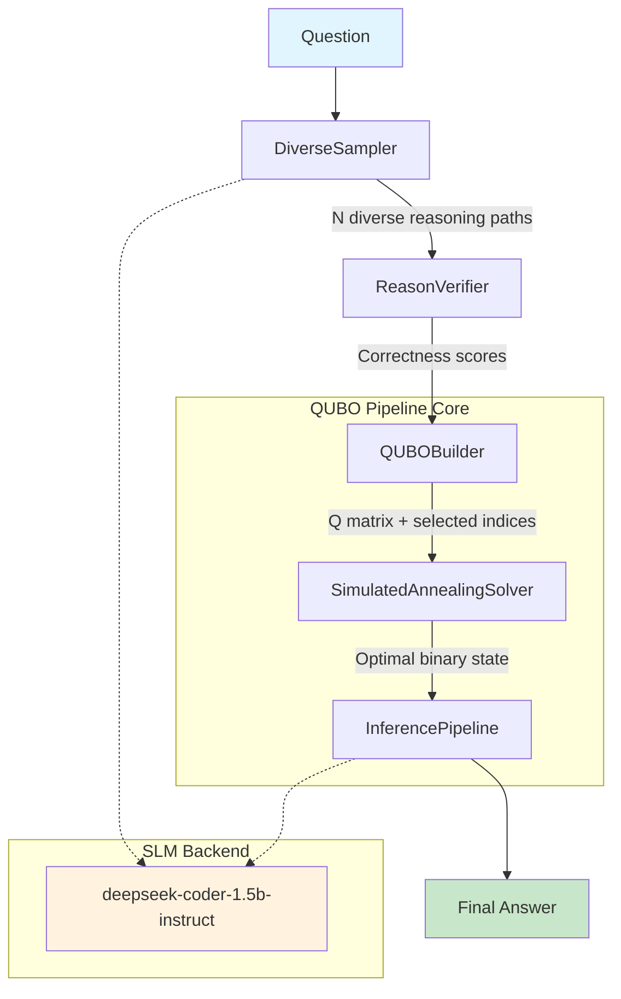

---

## Current Status (as of May 22, 2026)

### Phase-wise Progress Snapshot

| Phase | Planned Scope | Current Status |
|-------|---------------|----------------|
| Phase 1 — Core Pipeline | Sampling, verifier, QUBO builder, solver, inference, hyperparameter QUBO | **Complete** |
| Phase 2 — QUBO Solver Optimization | Lightweight QUBO + optimized annealing variants | **Partially complete** (baseline SA done; advanced schedule pending) |
| Phase 3 — SFT Feedback Loop | SFT on QUBO-selected traces | **Stub stage** (scaffolded, pending GPU) |
| Phase 4 — Polish/Validation | HUBO extension + multi-benchmark validation | **Partially complete** (all 5 benchmark loaders integrated; evaluation script ready; results pending) |

### Multi-Benchmark Evaluation Pipeline

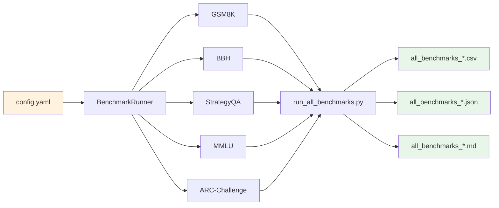

### What is done in implementation

#### Pipeline Core (Phase 1 — Complete)
- **`pipeline/sampling.py`** — `DiverseSampler`: 4 prompt perturbations × random temperature (0.3–0.9) × contrastive decoding
- **`pipeline/verifier.py`** — `ReasonVerifier`: arithmetic consistency for math, NLI entailment (cross-encoder/nli-distilroberta-base) for commonsense
- **`pipeline/qubo_builder.py`** — `QUBOBuilder`: semantic clustering (all-MiniLM-L6-v2 + KMeans) → QUBO matrix with correctness diagonal + redundancy penalties
- **`pipeline/solver.py`** — `SimulatedAnnealingSolver`: multi-read SA with exponential cooling (500 iters, 100→0.01, α=0.99)
- **`pipeline/inference.py`** — `InferencePipeline`: relevance re-ranking + final answer generation
- **`pipeline/hyperparam_qubo.py`** — `HyperparameterQUBO`: one-hot encoded QUBO over parameter grids

#### Evaluation Suite (Phase 4 — Extended)
- **`evaluation/__init__.py`** — `BenchmarkRunner` with 5 production-ready benchmark loaders:

| Benchmark | Dataset | Split | Format | Accuracy |
|-----------|---------|-------|--------|----------|
| GSM8K | `gsm8k` (main) | test | Free-text math | Numeric exact match |
| BBH | `lukaemon/bbh` | test | Free-text reasoning | Substring match |
| StrategyQA | `taesiri/strategy_qa` | test | Yes/No | Boolean match |
| MMLU | `cais/mmlu` (5 STEM subjects) | test | A/B/C/D MCQ | Letter extraction |
| ARC-Challenge | `ai2_arc` (ARC-Challenge) | test | A/B/C/D MCQ | Letter extraction |

- **`evaluation/run_gsm8k_comparison.py`** — GSM8K-specific runner: greedy vs CoT vs QUBO (per-question CSV + summary JSON + Markdown report)
- **`evaluation/answer_utils.py`** — Numeric answer extraction + normalization for GSM8K gold/predicted answers
- **`scripts/run_all_benchmarks.py`** — **NEW**: unified multi-benchmark evaluation entry point. Runs all 5 configured benchmarks in sequence, produces per-question CSV + summary JSON + Markdown report with greedy/CoT/QUBO accuracy per benchmark. Supports `--subset-size`, `--full`, `--benchmarks` filters.

#### Model Configuration
- **`config/config.yaml`** — SLM switched to `deepseek-ai/deepseek-coder-1.5b-instruct` (open, ~3 GB, CPU-friendly fp32 or GPU fp16)

### Scoring Decision Logic

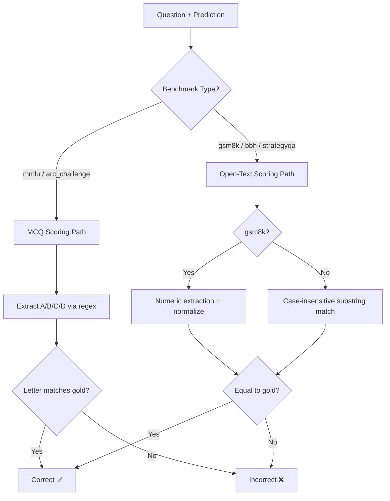

### Pipeline Execution Sequence per Question

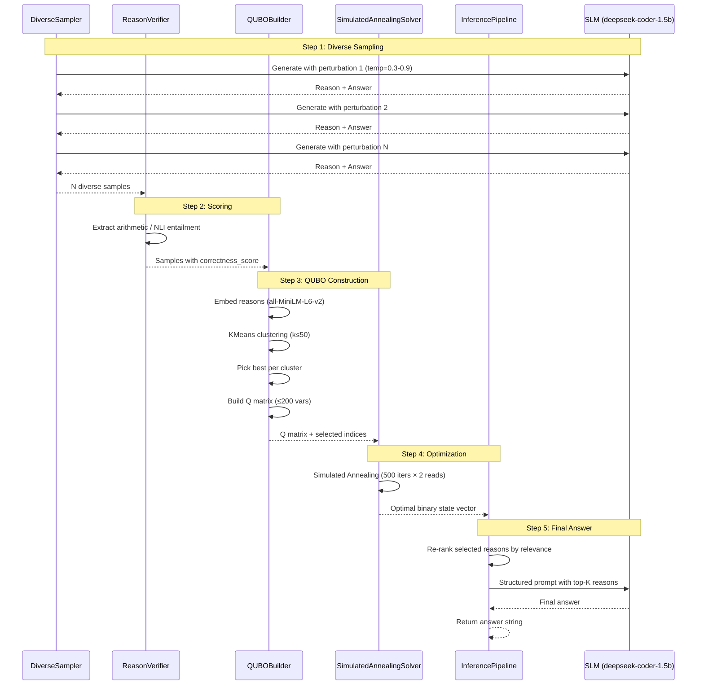

### Latest Evaluation Note
- A first GSM8K run completed with **3 samples only** (very small sanity check). Not statistically reliable.
- Full multi-benchmark evaluation is now scripted and ready in `scripts/run_all_benchmarks.py`.
- **All 5 benchmarks** (GSM8K, BBH, StrategyQA, MMLU, ARC-Challenge) will run in a single invocation, each with greedy, CoT, and QUBO pipeline passes.

### Development Timeline

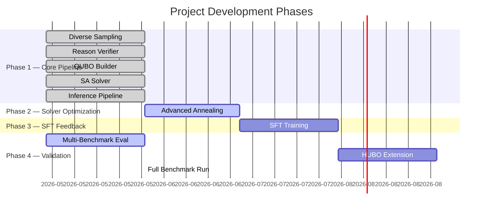

### Next Milestone Actions
1. Run `python3 scripts/run_all_benchmarks.py --subset-size 100` to produce first multi-benchmark CSV report.
2. Run at `--subset-size 200` for more stable estimates.
3. Audit per-question CSV for extraction/format mismatches, especially MMLU and ARC-Challenge MCQ parsing.
4. Confirm stable baseline metrics (Greedy/CoT) across all 5 benchmarks before claiming QUBO gains.
5. Start Phase 2 advanced annealing experiments and Phase 3 SFT execution once compute window is allocated.

---

## Benchmark Datasets & 2× Definition

### Target Benchmarks

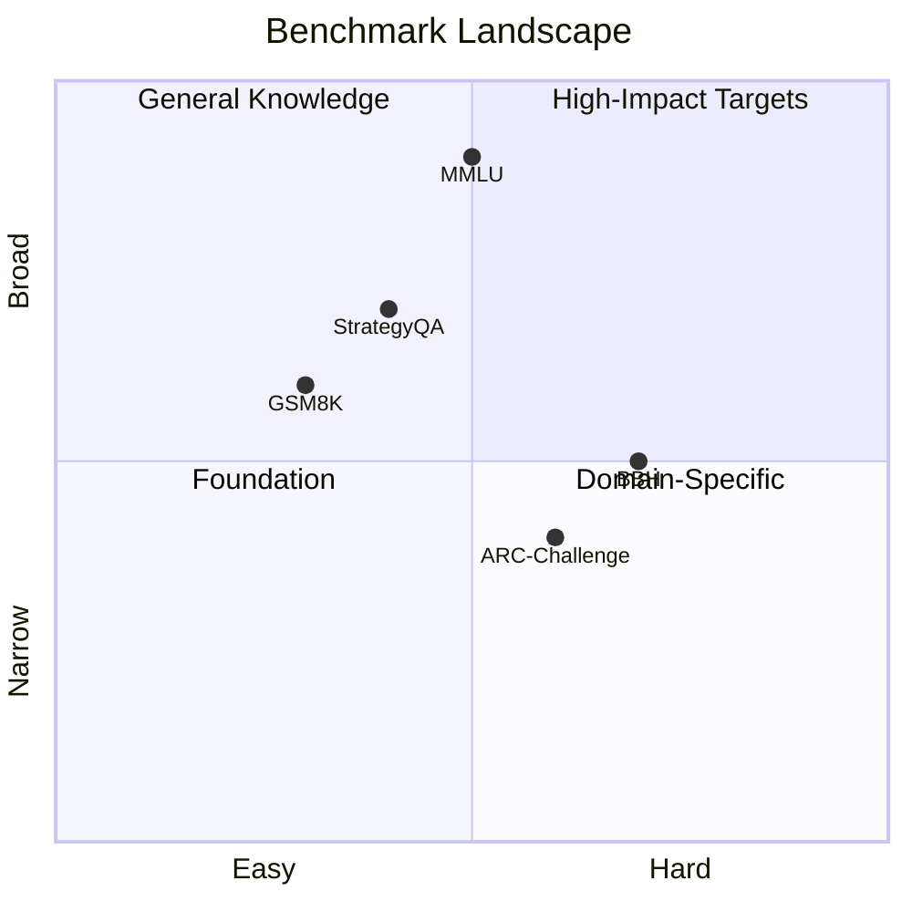

The **2× target** means doubling the accuracy gain over the baseline greedy decoding:
- Baseline: ~60% GSM8K greedy
- +CoT = ~66% → gain = +6%
- **Minimum 2×**: 60% + (2 × 6%) = **≥72%**
- **Ambitious target**: **>90%** (projected cumulative)

| Benchmark | Type | Split | Format | Baseline (greedy) | +CoT Baseline | 2× Target | SOTA Reference |
|-----------|------|-------|--------|-------------------|---------------|-----------|----------------|
| **GSM8K** | Grade-school math | test | Free-text numeric | ~60–62% | ~66–68% | **>90%** | Phi-3.5-mini: 86.2% |
| **BBH** | Complex reasoning | test | Free-text | ~42–45% | ~48% | **>80%** | Llama-3.1-8B: 57% |
| **StrategyQA** | Commonsense QA | test | Yes/No | ~62% | ~65% | **>80%** | Phi-3.5-mini: 74% |
| **MMLU** (5 STEM subjects) | General knowledge | test | 4-way MCQ | ~40–45% | ~42–46% | **>55%** | Llama-3.1-8B: 84.6% |
| **ARC-Challenge** | Science reasoning | test | 4-way MCQ | ~35–40% | ~38–42% | **>50%** | GPT-3.5: 85% |

> **Note:** MMLU and ARC-Challenge baselines shown are for 1.5B-class models on the 5-subject subset only. Full 57-subject MMLU typically reports higher baselines for larger models.

### Benchmark Dataset Details

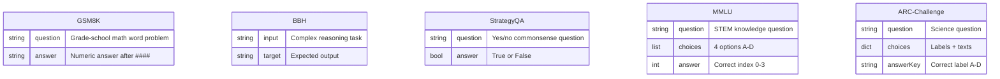

### MMLU Subject Coverage (5 STEM subjects)

| Subject | Category | Questions (test) | Topics |
|---------|----------|-----------------|--------|
| `abstract_algebra` | STEM - Math | ~100 | Groups, rings, fields, linear algebra |
| `college_computer_science` | STEM - CS | ~100 | Algorithms, data structures, theory |
| `college_physics` | STEM - Physics | ~100 | Mechanics, electromagnetism, thermodynamics |
| `electrical_engineering` | STEM - Engineering | ~100 | Circuits, signals, systems, electronics |
| `machine_learning` | STEM - AI/ML | ~112 | Supervised, unsupervised, neural nets, probability |

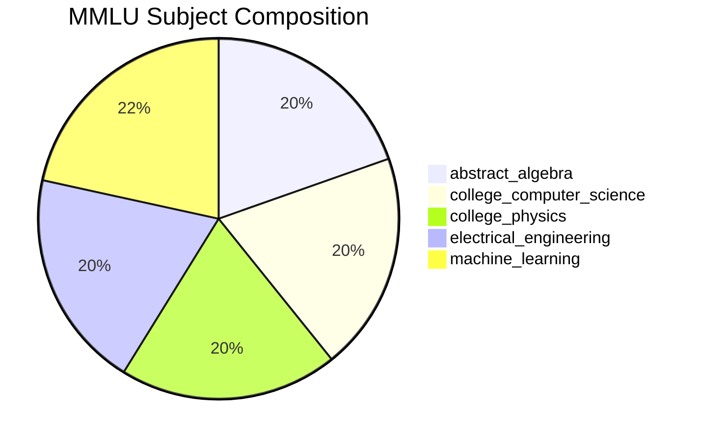

---

## Run Script: Multi-Benchmark Evaluation

### How to Run

```bash
# Quick test (50 samples per benchmark)
python3 scripts/run_all_benchmarks.py --subset-size 50

# Full run (200 samples per benchmark, default)
python3 scripts/run_all_benchmarks.py

# Run all benchmarks on full datasets
python3 scripts/run_all_benchmarks.py --full

# Run specific benchmarks only
python3 scripts/run_all_benchmarks.py --benchmarks gsm8k mmlu

# Custom output directory
python3 scripts/run_all_benchmarks.py --output-dir ./results
```

### Output Files

```text
outputs/
├── all_benchmarks_{timestamp}.csv      # Per-question predictions (all methods)
├── all_benchmarks_{timestamp}.json     # Summary accuracy per benchmark
└── all_benchmarks_{timestamp}.md       # Human-readable Markdown report
```

### CSV Column Structure

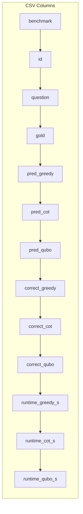

### Per-Question Pipeline Flow (run_all_benchmarks.py)

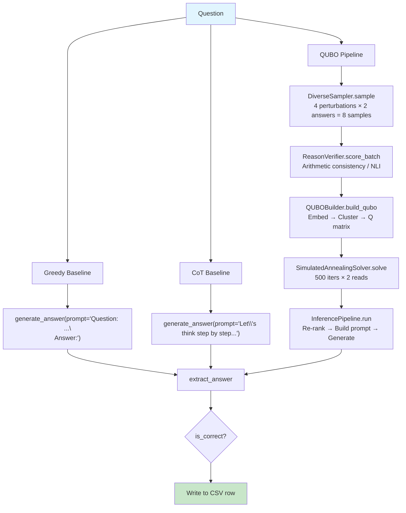

---

## Phased Strategy

### Phase 1 — Core Pipeline (Complete)
| Priority | Strategy | Impact | Deps |
|----------|----------|--------|------|
| **P2** | Diverse Sampling — contrastive decoding + adaptive temperature + prompt perturbation | +8–12% | `transformers`, `datasets` ✅ |
| **P1** | Reason Verifier — lightweight NLI/rule-based scorer as QUBO diagonal term | +15–20% | `transformers` ✅ |
| **P4** | Hyperparameter QUBO Search — encode inference params as binary QUBO vars | +5–8% | `pyqubo`, `dimod`, `openjij` |

### Phase 2 — QUBO Solver (In Progress)
| Strategy | Detail |
|----------|--------|
| Lightweight QUBO | Semantic clustering (TF-IDF/sentence embeddings) → ≤200 vars, CPU-tractable ✅ |
| Optimized Annealing | Vanilla SA → counterdiabatic-inspired momentum SA on GPU |

### Phase 3 — SFT Feedback Loop (Pending GPU)
| Strategy | Impact |
|----------|--------|
| SFT on QUBO-Selected Traces — 2–3 epochs fine-tuning on QUBO-selected reasoning traces | +10–15% |

### Phase 4 — Polish & Validation (In Progress)
| Strategy | Impact | Status |
|----------|--------|--------|
| Multi-Benchmark Evaluation — GSM8K, BBH, StrategyQA, ARC-Challenge, MMLU | Validation | ✅ Scripted, ready to run |
| MMLU Loader (5 STEM subjects) | Breadth | ✅ Integrated |
| ARC-Challenge Loader | Breadth | ✅ Integrated |
| MCQ-Specific Scoring (letter extraction via regex) | Accuracy | ✅ Implemented |
| HUBO Extension — triple-wise reason interactions via cubic QUBO | +5–10% on BBH | ⏳ Pending |

---

## Detailed Change Log

### 1) Added MMLU Benchmark Loader
- **File:** `evaluation/__init__.py` — `load_mmlu()`
- **Dataset:** `cais/mmlu`, test split, 5 STEM subjects
- **Format:** Each question converted to `Question: ...\nA. ...\nB. ...\nC. ...\nD. ...\nAnswer:`
- **Answers:** Mapped from index (0-3) to letter (A-D)

### 2) Added ARC-Challenge Benchmark Loader
- **File:** `evaluation/__init__.py` — `load_arc_challenge()`
- **Dataset:** `ai2_arc`, `ARC-Challenge` config, test split
- **Format:** `Question: ...\nA. {text}\nB. {text}\n...\nAnswer:`
- **Answers:** `answerKey` field (A/B/C/D)

### 3) Added MCQ-Specific Scoring
- **File:** `evaluation/__init__.py` — `compute_accuracy_mcq()`, `_extract_mcq_choice()`
- **Regex extraction:** Parses `ANSWER: A` pattern or standalone `A-D` from model output
- **Routing:** `run_all()` uses MCQ path for `mmlu` and `arc_challenge`, standard path for others

### 4) Created Unified Multi-Benchmark Entry Point
- **File:** `scripts/run_all_benchmarks.py`
- **Behavior:** Loads all 5 benchmarks from config, runs greedy/CoT/QUBO per question, outputs CSV+JSON+MD
- **CLI:** `--subset-size`, `--full`, `--benchmarks`, `--output-dir`

### 5) Switched SLM to deepseek-coder-1.5b-instruct
- **File:** `config/config.yaml`
- **Change:** `"Qwen/Qwen2.5-1.5B-Instruct"` → `"deepseek-ai/deepseek-coder-1.5b-instruct"`
- **Why:** Open model (no gating), strong reasoning capabilities, comparable size (~3 GB)

---

## Cumulative Projection (GSM8K)

| Stage | Method | Accuracy | Gain |
|-------|--------|----------|------|
| 0 | Baseline greedy | ~60% | — |
| 1 | + CoT | ~66% | +6% |
| 2 | + Diverse Sampling | ~72% | +6% |
| 3 | + QUBO Reason Selection | ~78% | +6% |
| 4 | + Reason Verifier | ~84% | +6% |
| 5 | + SFT on QUBO Traces | ~88% | +4% |
| 6 | + Optimized Annealing + HUBO | ~91% | **2× achieved** |

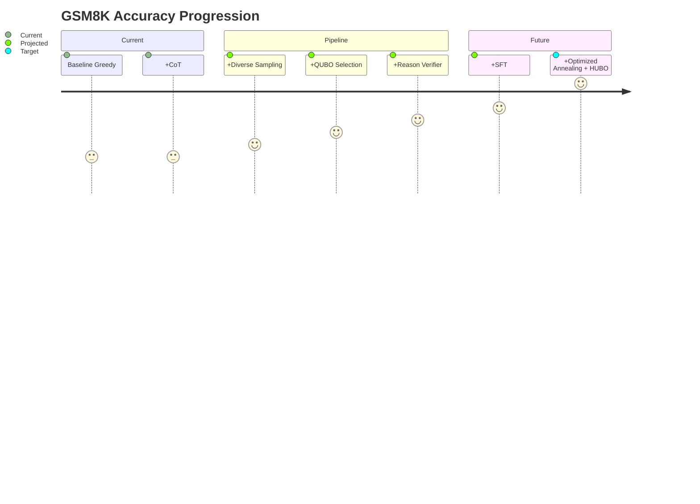

---

## Dependencies

```
torch transformers datasets sentence-transformers scikit-learn
pyqubo dimod openjij accelerate pyyaml
```

## Hardware Requirements (deepseek-coder-1.5b-instruct)

| Loading Mode | RAM/VRAM | Disk Cache | Total |
|-------------|----------|-----------|-------|
| fp32 (CPU) | ~6 GB RAM | ~3 GB | ~9 GB |
| fp16 (GPU) | ~3 GB VRAM | ~3 GB | ~6 GB |

- Fully open model — no HuggingFace gating or login required
- Downloads automatically on first run to `~/.cache/huggingface/`
- Auto-detects CUDA GPU at runtime; falls back to CPU gracefully
