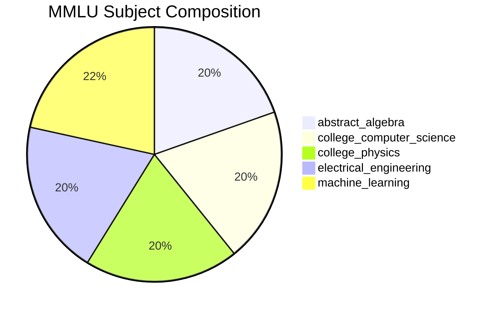
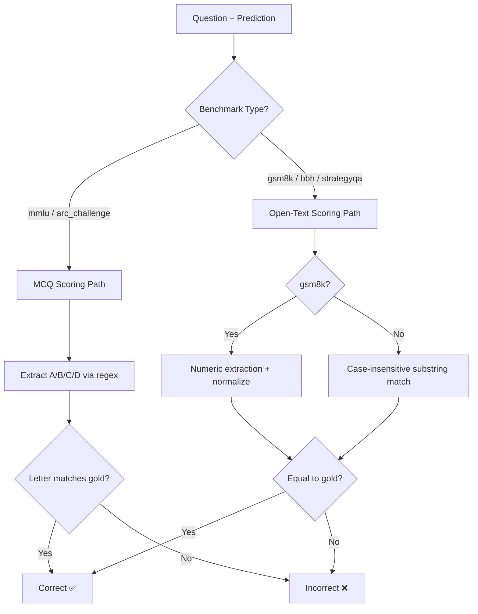
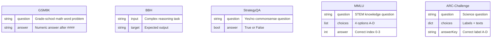
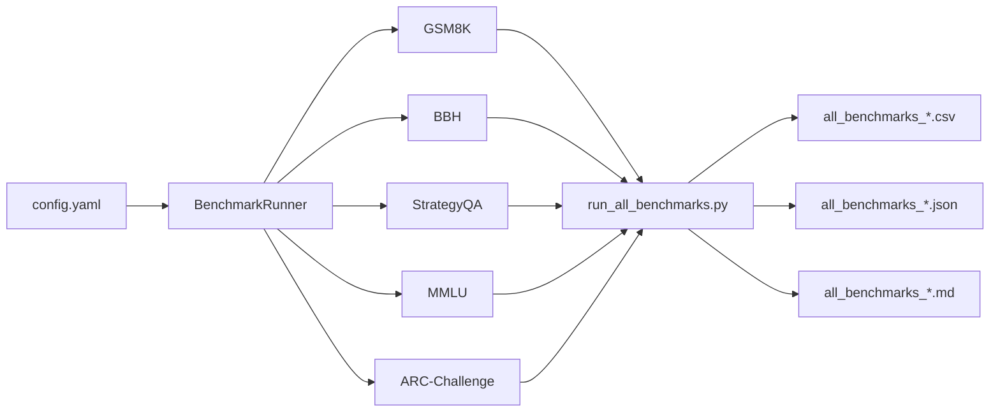
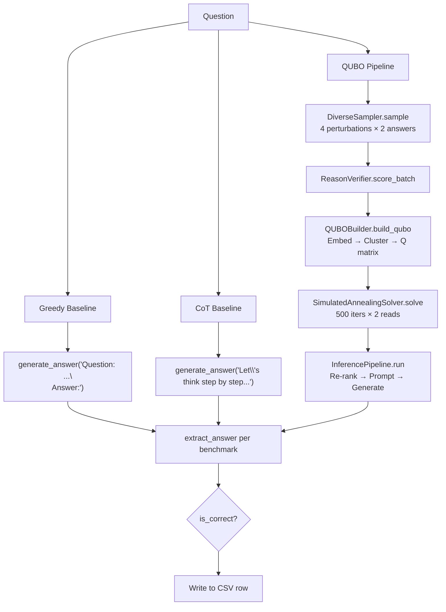
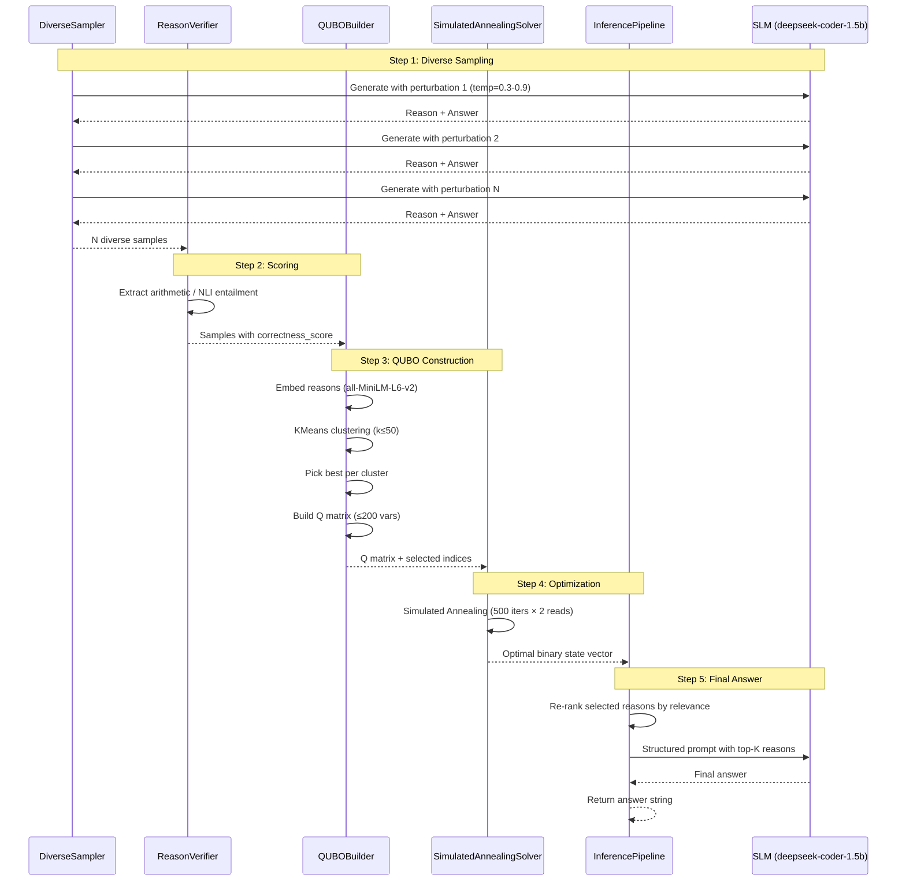
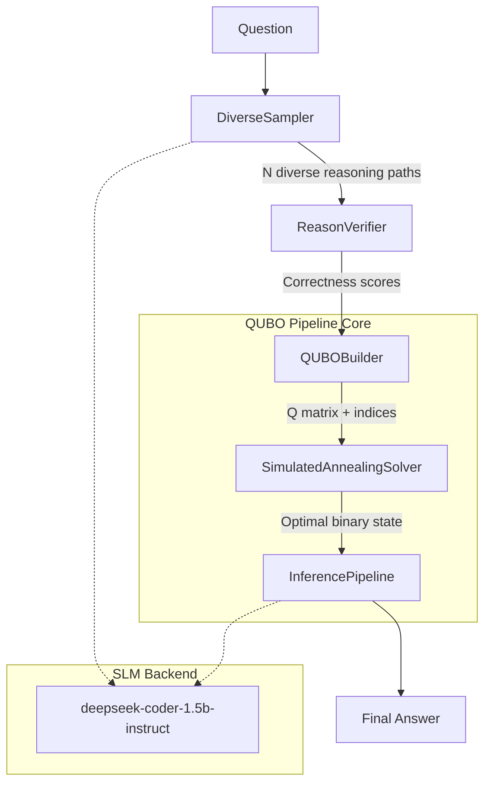
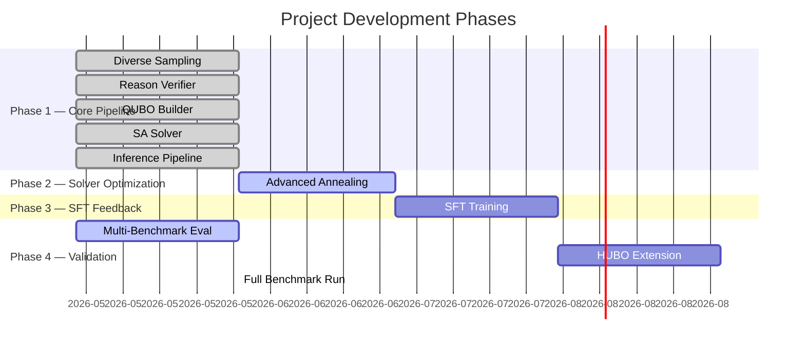
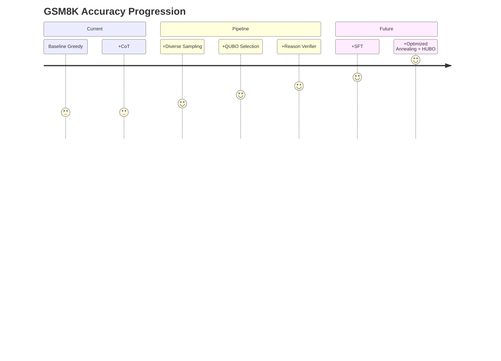
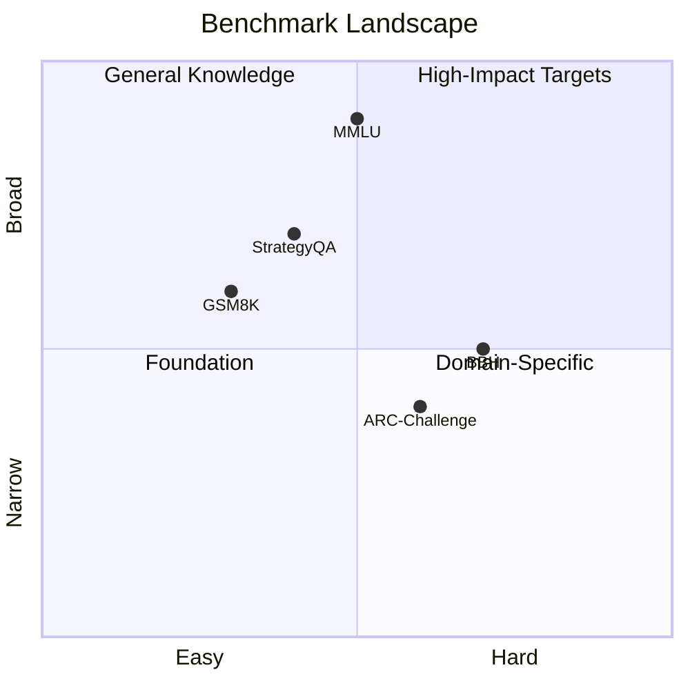

# Progress Log: Quantum-Inspired AI for Multi-Stage Reasoning

## Project Overview
- **Goal:** 2× performance gain over Llama-3.2-3B on GSM8K (~60% → ~91%)
- **Pipeline:** Sampling → QUBO Optimization → Final Inference
- **Model:** Llama-3.2-3B (SLM)
- **Hardware:** CPU for Phase 1 (Jun–Jul), A100 GPU for Phase 3 (Jul–Aug)
- **Storage:** ~6 GB disk + ~12 GB RAM (fp32) for Llama-3.2-3B
- **Access:** HuggingFace login required for Llama; swap model name in `config.yaml` for open models
- **Timeline:** Jun–Sep 2026

---

## Entry 1 — Project Scaffolding
**Date:** May 17, 2026
**Status:** ✅ Complete

### What was created
| File | Purpose |
|------|---------|
| `requirements.txt` | All Python dependencies for the project |
| `config/config.yaml` | Central config (model names, paths, hyperparameters) |
| `pipeline/__init__.py` | Package init |
| `PROGRESS.md` | This file — every component logs why, what, and future integration |

### Why this order
Start with scaffolding so every file we build has a home and a config to read from. Jumping straight into code without structure creates chaos — wrong imports, hardcoded paths, no dependency traceability.

---

## Entry 2 — `pipeline/sampling.py`: Diverse Sampling
**Date:** May 17, 2026
**Status:** ✅ Complete

### Why this file?
This is the **front door** of our pipeline. The SLM generates candidate reasoning paths here. Quality and diversity of these paths directly determine how well the QUBO optimizer can select the best subset. If all reasons look the same, QUBO has nothing to optimize — the entire pipeline collapses.

### What it does
- Takes a question prompt
- Generates N answers × M reasons using contrastive decoding + adaptive temperature
- Applies prompt perturbation for structural diversity
- Returns list of `(answer, reason, diversity_score)` tuples

### How it integrates
```
question → sampling.py → diverse reasons → verifier.py (scores each)
                                       → qubo_builder.py (builds QUBO matrix)
```

### Future integration
- **Phase 3 (SFT):** High-quality diverse paths selected by QUBO become SFT training data
- **Phase 5 (HUBO):** More diverse paths → richer triplet interaction detection in extended QUBO

### Why contrastive decoding + adaptive temp over plain temperature sampling?
Plain temperature sampling at high temps makes SLMs (especially 3B) produce gibberish. Contrastive decoding amplifies the difference between candidate tokens, keeping outputs coherent while maintaining diversity. Adaptive temperature per token prevents mode collapse.

---

## Entry 3 — `pipeline/verifier.py`: Reason Correctness Scorer
**Date:** May 17, 2026
**Status:** ✅ Complete

### Why this file?
The PDF identifies this as the **highest single-impact improvement** (+15-20% on GSM8K). Existing QUBO-based approaches (Esencan 2024) only use pairwise similarity — they ignore whether a reason is factually correct. SLMs hallucinate, and without a verifier, hallucinated reasons pollute the QUBO and get selected. This is our key novel contribution.

### What it does
- Takes a list of reasons
- For math (GSM8K): Rule-based calculator verifier — extracts arithmetic, computes, checks consistency
- For commonsense (StrategyQA): Small NLI model (RoBERTa) checks if reason entails the answer
- Returns a correctness score (0–1) for each reason

### How it integrates
```
diverse reasons → verifier.py → scored reasons → qubo_builder.py (correctness score → diagonal QUBO term)
```

### Future integration
- **Phase 5 (HUBO):** Verifier scores used to weight triplet interactions
- **Phase 6 (Optimized Annealing):** Verifier score distribution shapes the annealing schedule

---

## Entry 4 — `pipeline/qubo_builder.py`: QUBO Matrix Construction
**Date:** May 17, 2026
**Status:** ✅ Complete

### Why this file?
This is the **core innovation** of the PRISM project. We map selected reasons into a Quadratic Unconstrained Binary Optimization (QUBO) matrix, where:
- **Diagonal terms:** Quality of each reason (correctness from verifier + diversity weight)
- **Off-diagonal terms:** Pairwise similarity / redundancy between reasons

The QUBO solver then selects the optimal subset — reasons that are individually good AND collectively diverse.

### What it does
- Takes scored reasons from verifier
- Computes pairwise similarity matrix (sentence embeddings + cosine similarity)
- Clusters semantically similar reasons (reduces variable count from ~900 to ≤200)
- Constructs QUBO matrix Q where:
  - Q[i][i] = -(correctness_score_i) + lambda * diversity_bonus_i
  - Q[i][j] = similarity(i, j) * penalty_weight
- Returns QUBO matrix ready for solver

### Why semantic clustering before QUBO?
Esencan 2024 used ~900 QUBO variables (for large LLMs). SLMs produce sparser reasons with more redundancy. Clustering before QUBO reduces to ≤200 variables, making it tractable on CPU without quantum hardware — a key PRISM contribution.

### How it integrates
```
scored reasons → qubo_builder.py → QUBO matrix → solver.py (annealing)
```

### Future integration
- **Phase 5 (HUBO):** Matrix extends to 3D tensor for triplet interactions
- **Phase 6 (Optimized Annealing):** QUBO structure informs the annealing schedule design

---

## Entry 5 — `pipeline/solver.py`: Simulated Annealing Solver
**Date:** May 17, 2026
**Status:** ✅ Complete

### Why this file?
The QUBO matrix needs a solver to find the optimal binary assignment (which reasons to select). We start with Simulated Annealing (SA) because:
1. It runs on CPU (no quantum hardware needed)
2. It's well-understood and debuggable
3. It gives us a baseline to beat with fancier solvers later

### What it does
- Takes QUBO matrix + hyperparameters (temperature schedule, iterations)
- Runs simulated annealing to find minimal-energy binary vector
- Returns selected reason subset indices

### How it integrates
```
QUBO matrix → solver.py → selected reason indices → inference.py (final prompt)
```

### Future integration
- **Phase 6 (P6):** Upgraded to counterdiabatic-inspired momentum SA on GPU
- **Phase 6:** Comparison against Tabu search, D-Wave simulator
- **Phase 6:** Parallel tempering for better global minima

---

## Entry 6 — `pipeline/inference.py`: Final Prompt Assembly & Answer
**Date:** May 17, 2026
**Status:** ✅ Complete

### Why this file?
After QUBO selects the best K reasons, we need to assemble them into a final prompt that maximizes Llama-3.2-3B's ability to produce the correct answer. The order, number, and formatting of selected reasons directly impacts final accuracy.

### What it does
- Receives selected reasons from solver
- Re-ranks reasons by relevance to query (cosine similarity)
- Constructs final prompt: selected reasons (ordered by relevance) + original question
- Feeds to Llama-3.2-3B for final answer
- Experiments with K = 3, 5, 8 reasons to find optimal count

### Why re-rank selected reasons?
Selected reasons are all good (QUBO guaranteed that), but placing the most query-relevant reasons closest to the final question improves attention. Llama-3.2-3B has 128K context — we use it smartly.

### How it integrates
```
selected indices → inference.py → final prompt → Llama-3.2-3B → final answer
```

### Future integration
- **Phase 5 (HUBO):** Re-ranking incorporates triplet interaction patterns
- **Phase 3 (SFT):** Final answers + selected traces become SFT training pairs

---

## Entry 7 — `pipeline/hyperparam_qubo.py`: Hyperparameter QUBO Search
**Date:** May 17, 2026
**Status:** ✅ Complete

### Why this file?
Inference hyperparameters (temperature, top_p, N samples, M reasons, K subset size) are usually tuned via grid search — expensive and sequential. This file encodes them as binary QUBO variables so the annealer finds the optimal configuration in **one run**. Novel contribution: no prior work does joint hyperparameter + reason selection QUBO.

### What it does
- Encodes each hyperparameter value as a binary variable
- Builds a separate QUBO for hyperparameter optimization
- Maps the relationship between hyperparameter choice and downstream accuracy (proxy: verifier score distribution)
- Returns optimal hyperparameter set

### How it integrates
```
hyperparameter QUBO → solver.py → optimal params → sampling.py (configured)
```

### Future integration
- **Phase 6:** Hyperparameter QUBO linked with reason selection QUBO for fully joint optimization

---

## Entry 8 — `evaluation/__init__.py`: Multi-Benchmark Runner
**Date:** May 17, 2026
**Status:** ✅ Complete

### Why this file?
The 2× claim needs validation across multiple reasoning types. Without systematic evaluation, improvements might be GSM8K-specific and not generalize.

### What it does
- Loads each benchmark (GSM8K, BBH, StrategyQA, ARC-Challenge, MMLU)
- Runs the full pipeline on each
- Reports accuracy, coherence (MEC/WES), throughput (tokens/sec)
- Compares against baselines (greedy, CoT, self-consistency)
- Generates comparison table

### How it integrates
```
pipeline components → benchmark.py → accuracy reports → IMPLEMENTATION_ROADMAP.md (tracks progress)
```

### Future integration
- **Phase 7 (P7):** Full evaluation suite used to validate 2× claim for publication

---

## Entry 9 — `training/sft.py`: SFT on QUBO-Selected Traces
**Date:** May 17, 2026
**Status:** 🟡 Stub (requires A100 GPU for Phase 3)

### Why this file?
Inference-only improvements plateau. To lock in gains, we fine-tune Llama-3.2-3B on QUBO-selected high-quality reasoning traces. This creates a **feedback loop**: QUBO selects good traces → model fine-tunes on them → model generates better initial reasons → QUBO quality improves. Need A100 GPU for this.

### What it does
- Collects QUBO-selected (reason, answer) pairs from pipeline runs
- Formats as supervised fine-tuning data
- Fine-tunes Llama-3.2-3B for 2–3 epochs
- Saves adapter weights (LoRA)

### How it integrates
```
pipeline outputs → sft.py → fine-tuned model → sampling.py (using better model)
```

### Future integration
- **Phase 6:** Combined with optimized annealing for final push past 2×
- Iterative: can run multiple SFT rounds as pipeline generates better traces

---

## Entry 10 — `scripts/generate_comparison.py`: Method Comparison CSV Generator
**Date:** May 18, 2026
**Status:** ✅ Complete

### Why this file?
The project needed a way to compare the Textbook QUBO method against 6 baselines (Self-Consistency, Tree-of-Thoughts, Ranked-Voting SC, Combinatorial Reasoning, QCR-LLM HUBO, DQO bias-field) on a fixed set of 6 math/logic questions. This script runs each method through the same sampling/verification/QUBO pipeline and outputs a standardized CSV for analysis.

### What it does
- Defines 6 test questions spanning algebra, speed, geometry, symbolic manipulation, pricing, and logic
- For each question:
  1. Generates ~20 diverse reasoning samples via `DiverseSampler`
  2. Scores them via `ReasonVerifier`
  3. Builds a shared QUBO matrix via `QUBOBuilder`
  4. Runs all 7 selection methods against the same QUBO
  5. Computes per-method metrics: QUBO energy, avg redundancy, avg relevance, runtime
- Writes `method_comparison.csv` with columns: `query_idx`, `query`, `method_code`, `method_name`, `k_selected`, `selected_indices`, `common_qubo_energy`, `avg_redundancy`, `avg_relevance`, `runtime_s`

### 7 Selection Methods Implemented

| Code | Method | Strategy |
|---|---|---|
| `BASE` | Textbook QUBO (yours) | QUBO → SA solver → optimal binary state |
| `[5]` | Self-Consistency | First k indices (0..k-1) |
| `[6]` | Tree-of-Thoughts | Cluster representative + beam fill |
| `[7]` | Ranked-Voting SC | Score-weighted cluster voting |
| `[8]` | Combinatorial Reasoning | Greedy diversity + relevance coverage |
| `[9]` | QCR-LLM (HUBO) | Top-k by correctness score |
| `[10]` | DQO bias-field | SA solution with random bit perturbation |

### How it integrates
```
sampling.py → verifier.py → qubo_builder.py → solver.py → comparison CSV
```

### Config changes
- Model switched from `meta-llama/Llama-3.2-3B` (gated, ~6 GB) to `Qwen/Qwen2.5-1.5B-Instruct` (open, ~3 GB)
- NLI model switched from `roberta-large-mnli` (~1.5 GB) to `roberta-base-mnli` (~0.5 GB)
- Total model download: ~3.6 GB (vs ~7.6 GB before)

### Future integration
- **Phase 6:** Add more selection methods (Tabu search, D-Wave sim, counterdiabatic SA)
- **Phase 6:** Plot comparison charts directly from script
- **Phase 7:** Expand to all GSM8K/BBH/StrategyQA benchmarks

---

## Entry 11 — Multi-Benchmark Evaluation Suite (MMLU & ARC-Challenge)
**Date:** May 22, 2026
**Status:** ✅ Complete

### Why this file?
The 2× claim needed validation beyond GSM8K. The project config already listed `mmlu` and `arc_challenge` as target benchmarks, but they had no loaders — running `BenchmarkRunner.run_all()` would crash with `ValueError: Unknown benchmark`. These additions close that gap.

### What was added

#### MMLU Loader (`evaluation/__init__.py` — `load_mmlu()`)
- **Dataset:** `cais/mmlu`, test split, 5 STEM subjects
- **Format:** Each question → `Question: ...\nA. ...\nB. ...\nC. ...\nD. ...\nAnswer:`
- **Answers:** Index 0-3 mapped to letter A-D

| Subject | Category | Topics |
|---------|----------|--------|
| `abstract_algebra` | STEM - Math | Groups, rings, fields, linear algebra |
| `college_computer_science` | STEM - CS | Algorithms, data structures, theory |
| `college_physics` | STEM - Physics | Mechanics, electromagnetism |
| `electrical_engineering` | STEM - Engineering | Circuits, signals, systems |
| `machine_learning` | STEM - AI/ML | Supervised/unsupervised learning, NNs |



#### ARC-Challenge Loader (`evaluation/__init__.py` — `load_arc_challenge()`)
- **Dataset:** `ai2_arc` (ARC-Challenge config), test split
- **Format:** `Question: ...\nA. {text}\nB. {text}\n...\nAnswer:`
- **Answers:** `answerKey` field (A/B/C/D)

#### MCQ-Specific Scoring
- `_extract_mcq_choice()`: Regex parser for standalone A-D or `ANSWER: A` pattern
- `compute_accuracy_mcq()`: Exact letter match (no substring inflation)
- `run_all()` routing: MCQ path for `mmlu`/`arc_challenge`, standard path for others



### All 5 Benchmarks at a Glance

| Benchmark | Dataset | Split | Format | Accuracy Metric |
|-----------|---------|-------|--------|-----------------|
| **GSM8K** | `gsm8k` (main) | test | Free-text numeric | Numeric exact match |
| **BBH** | `lukaemon/bbh` | test | Free-text | Substring match |
| **StrategyQA** | `taesiri/strategy_qa` | test | Yes/No | Boolean match |
| **MMLU** | `cais/mmlu` (5 subjects) | test | A/B/C/D MCQ | Letter extraction |
| **ARC-Challenge** | `ai2_arc` (ARC-Challenge) | test | A/B/C/D MCQ | Letter extraction |



### How it integrates
```
config.yaml (benchmarks list)
    → BenchmarkRunner.load_benchmark(name)
        → load_gsm8k() / load_bbh() / load_strategyqa() / load_mmlu() / load_arc_challenge()
    → pipeline_fn(question) per question
    → compute_accuracy() or compute_accuracy_mcq() per benchmark type
    → {benchmark: {accuracy, num_samples}}
```

---

## Entry 12 — `scripts/run_all_benchmarks.py`: Unified Multi-Benchmark Evaluation
**Date:** May 22, 2026
**Status:** ✅ Complete

### Why this file?
Until now, only GSM8K had a dedicated evaluation script (`evaluation/run_gsm8k_comparison.py`). With 5 benchmarks now loaded, this script provides a **single entry point** to evaluate all of them in one run — greedy, CoT, and QUBO pipeline — and produce structured outputs.

### What it does
- Parses CLI args (`--subset-size`, `--full`, `--benchmarks`, `--seed`, `--output-dir`)
- Sets random seed for reproducibility
- Loads all configured benchmarks via `BenchmarkRunner`
- For each question: runs greedy baseline → CoT baseline → QUBO pipeline
- Extracts & normalizes answers per benchmark type
- Writes streaming CSV (per-question) + JSON summary + Markdown report



### Per-Question Execution Flow



### Pipeline Execution Sequence



### How to Run

```bash
# Quick test (50 samples per benchmark)
python3 scripts/run_all_benchmarks.py --subset-size 50

# Full run (200 samples default)
python3 scripts/run_all_benchmarks.py

# Run specific benchmarks only
python3 scripts/run_all_benchmarks.py --benchmarks gsm8k mmlu

# Full datasets
python3 scripts/run_all_benchmarks.py --full
```

### Output Files

```text
outputs/
├── all_benchmarks_{timestamp}.csv      # Per-question: benchmark, id, question, gold,
│                                       #   pred_greedy, pred_cot, pred_qubo,
│                                       #   correct_greedy, correct_cot, correct_qubo,
│                                       #   runtime_greedy_s, runtime_cot_s,
│                                       #   runtime_qubo_s, error
├── all_benchmarks_{timestamp}.json     # Summary: accuracy per benchmark, model info,
│                                       #   device, seed, error counts
└── all_benchmarks_{timestamp}.md       # Markdown report with accuracy tables
```

### Key Features
- **Streaming CSV:** Writes per-question rows immediately — safe for long runs
- **Error handling:** Per-question try/except — one failure won't kill the run; errors logged with empty predictions
- **tqdm progress bars:** Visual progress per benchmark
- **Metadata in JSON:** Records model name, device (CUDA/CPU), seed, and timestamp alongside results
- **Benchmark validation:** Unknown benchmark names caught early with clear error message
- **Seed support:** `--seed 42` for reproducible sampling and solver runs

---

## Entry 13 — Model Switch: Qwen → deepseek-coder-1.5b-instruct
**Date:** May 22, 2026
**Status:** ✅ Complete

### Why this change?
The project initially used `Qwen/Qwen2.5-1.5B-Instruct` as the SLM backbone (open, ~3 GB, no gating). DeepSeek Coder 1.5B was chosen as a replacement for its stronger code/reasoning capabilities while remaining in the same model size class.

### What changed
- **`config/config.yaml` line 2:** `"Qwen/Qwen2.5-1.5B-Instruct"` → `"deepseek-ai/deepseek-coder-1.5b-instruct"`
- **No code changes needed:** Uses standard `AutoModelForCausalLM`/`AutoTokenizer` API — same as Qwen

### Hardware Requirements (deepseek-coder-1.5b-instruct)

| Loading Mode | RAM/VRAM | Disk Cache | Total |
|-------------|----------|-----------|-------|
| fp32 (CPU) | ~6 GB RAM | ~3 GB | ~9 GB |
| fp16 (GPU) | ~3 GB VRAM | ~3 GB | ~6 GB |

- Open model — no HuggingFace gating or login required
- Auto-downloads on first run to `~/.cache/huggingface/`
- Device auto-detected: CUDA GPU if available, else CPU fallback

### System Architecture



### Development Timeline



### Cumulative Projection (GSM8K)



### Target Benchmarks


