# Quantum-Inspired Annealing for Multi-Stage Reasoning

> A modular reasoning framework that generates diverse chains-of-thought, scores them, encodes selection as a QUBO optimization problem, and composes final answers using selected high-value reasoning traces.


---

## 1) Executive Summary

This project makes small language models (SLMs) **reason better** by generating many possible answers, picking the best ones using smart math, and combining them into a final response. Instead of trusting a single chain of thought, the pipeline:

1. Generates many diverse candidate reasoning paths
2. Scores each path for correctness
3. Selects the best subset using **QUBO optimization** (a way to solve "pick the best combination" problems)
4. Composes the final answer from selected traces

### How it works (in plain English)

Think of it like asking a group of experts to solve a puzzle:

| Step | What the code does | Everyday analogy |
|------|-------------------|------------------|
| 1. **Sample** | Generate many different solution attempts | Ask 20 people to solve it their own way |
| 2. **Verify** | Score each attempt for correctness | Check whose answers make sense |
| 3. **Select** | Pick the best non-redundant subset | Choose the 5 best answers that aren't just copies of each other |
| 4. **Answer** | Compose final response from selected traces | Synthesize the final answer from those 5 |

### What is QUBO?

QUBO (**Q**uadratic **U**nconstrained **B**inary **O**ptimization) is a mathematical framework for problems where you need to choose which items to keep and which to discard. It's like a checklist where:

- ✅ Picking a good reason **reduces** your total "cost" (negative score)
- ❌ Picking two similar reasons **increases** your cost (they're redundant)
- The solver finds the combination that minimizes total cost

We use **Simulated Annealing** to solve the QUBO — it's inspired by how metals cool slowly to form strong crystals, randomly trying different combinations and gradually settling on the best one.

### Why this matters
- Standard decoding is brittle for multi-step reasoning
- Majority-vote methods improve robustness but keep redundant answers
- QUBO-based selection trades off **quality vs diversity** in a principled way

### Core novelty
- Treats reasoning-trace selection as an explicit combinatorial optimization
- Integrates lightweight verifier scores and semantic similarity penalties into a unified QUBO matrix
- Supports benchmark-oriented evaluation (GSM8K, BBH, StrategyQA, ARC-Challenge, MMLU)

---

## 2) Motivation and Background

Modern SLM reasoning often fails due to local decoding errors, shallow heuristics, or brittle intermediate steps. Inference-time ensembling helps, but naively aggregating many traces can over-index on similar errors. This project is motivated by a simple observation:

> The best final answer often emerges from a **small, diverse, high-quality subset** of reasoning traces.

This repository explores a practical mechanism for subset selection using QUBO-style objectives, then uses selected traces to guide final generation.

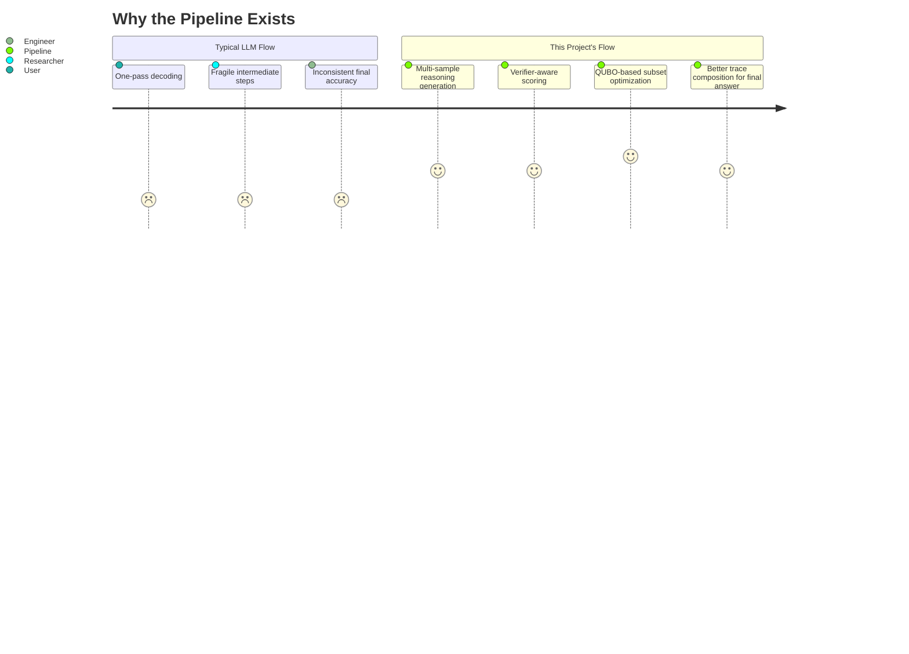

---

## 3) Feature Set

### Functional features
- Multi-template, multi-temperature reasoning sample generation.
- Heuristic + NLI-based reasoning verification.
- Semantic embedding and clustering for trace compression.
- QUBO matrix construction with correctness/diversity terms.
- Simulated annealing solver with configurable schedule.
- Final-answer generation from selected traces.
- Benchmark runners for GSM8K comparisons and multi-benchmark evaluation.

### Technical features
- YAML-driven configuration (`config/config.yaml`).
- GPU auto-detection for model modules (`cuda` when available).
- Modular code design by subsystem (`pipeline`, `evaluation`, `scripts`, `training`).
- Export paths for CSV/JSON/Markdown benchmark reports.

### Capability comparison

| Capability | Baseline Greedy | Plain CoT | This Pipeline |
|---|---:|---:|---:|
| Multiple reasoning traces | No | Limited | Yes |
| Verification step | No | No | Yes |
| Diversity-aware selection | No | No | Yes (QUBO) |
| Optimization objective | No | No | Explicit |
| Benchmark reporting | Basic | Basic | Structured CSV/JSON/MD |

---

## 4) System Architecture

### 4.1 High-level architecture


### 4.2 Module interaction graph

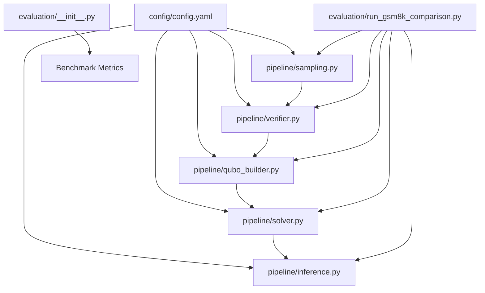

### 4.3 Runtime sequence

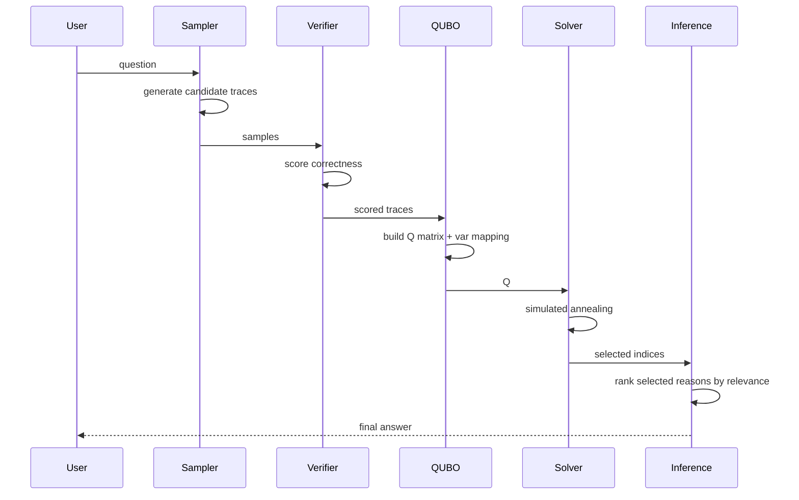

### 4.4 Data-flow model

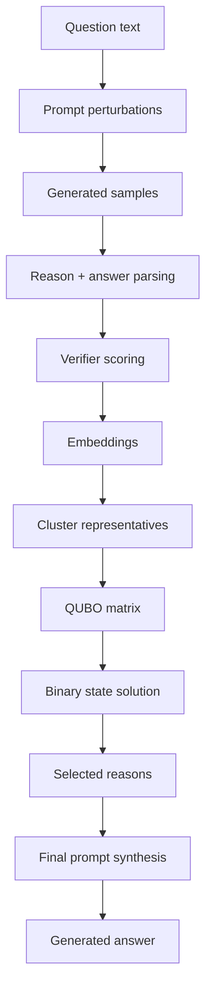

### 4.5 Dependency graph

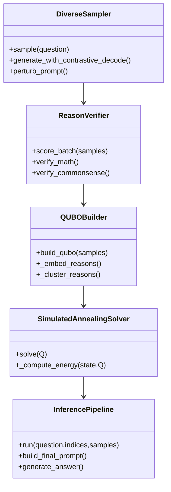

---

## 5) End-to-End Workflow

### Step-by-step processing

```mermaid
flowchart LR
    subgraph "1. Generate"
        A[Question] --> B[4 prompt variations]
        B --> C[8-16 candidate answers]
    end
    subgraph "2. Score"
        C --> D[Check arithmetic consistency]
        C --> E[OR check NLI entailment]
        D --> F[Each candidate gets a score 0-1]
        E --> F
    end
    subgraph "3. Select"
        F --> G[Embed reasons into vectors]
        G --> H[Cluster similar reasons]
        H --> I[Pick best per cluster]
        I --> J[Build QUBO matrix]
        J --> K[Simulated annealing]
        K --> L[Optimal subset chosen]
    end
    subgraph "4. Answer"
        L --> M[Re-rank by relevance]
        M --> N[Build final prompt]
        N --> O[Generate final answer]
    end
```

| Step | What happens | Why it matters |
|------|-------------|----------------|
| **1. Generate** | Question is rewritten 4 ways (e.g., "Let's solve step by step..."). Each variation generates 2-4 answers at different temperatures (0.3 to 0.9). | One answer might miss the mark; 16 diverse attempts cover more ground. |
| **2. Score** | For math: extracts numbers and operations, checks arithmetic consistency. For commonsense: uses an NLI model to check if the reason supports the answer. | Filters out nonsense and hallucinated steps early. |
| **3. Select** | Reasons are embedded, clustered, and the best per cluster is picked. A QUBO matrix is built where: diagonal = quality bonus, off-diagonal = redundancy penalty. Solved via simulated annealing. | Finds the small, high-quality, non-redundant subset — unlike naive top-K which picks redundant answers. |
| **4. Answer** | Selected reasons are re-ranked by relevance to the question. A prompt is built: "Here are some reasoning steps: {reasons}. Based on these, answer: {question}". Final answer generated greedily. | The model sees the best curated reasoning before answering, improving accuracy. |

### Decision logic

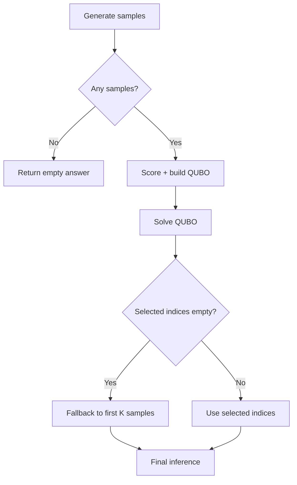

### Pipeline state transitions

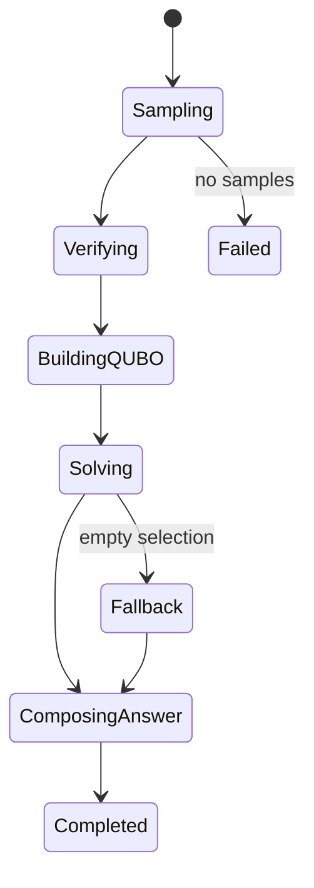

---

## 6) Technical Deep Dive

### `pipeline/sampling.py` - DiverseSampler
**In short:** Ask the same question in many different ways at different "creativity" levels.

- **How:** 4 prompt templates (e.g., "Let's solve step by step") × random temperatures (0.3-0.9) = 8-16 diverse answers
- **Output:** `{reason, answer, diversity_score, temperature, prompt_template}`
- **Tradeoff:** more diversity → better coverage → slower inference

### `pipeline/verifier.py` - ReasonVerifier
**In short:** Grade each answer. Math answers get checked for arithmetic consistency; commonsense answers get checked via NLI.

- **Math mode:** Extracts numbers and operations via regex `(\d+\.?\d*)\s*([+\-*/])\s*(\d+\.?\d*)`, computes results, checks if consecutive computations agree
- **Commonsense mode:** Uses `cross-encoder/nli-distilroberta-base` to measure if the reason entails the answer
- **Tradeoff:** heuristics are fast but not as accurate as symbolic proof checking

### `pipeline/qubo_builder.py` - QUBOBuilder
**In short:** Convert scored traces into a "pick the best combination" math problem.

1. **Embed** all reasons using SentenceTransformer (`all-MiniLM-L6-v2`)
2. **Cluster** semantically similar reasons (KMeans, up to 50 clusters)
3. **Pick the best** reason from each cluster (highest correctness score)
4. **Build Q matrix:** diagonal = quality reward, off-diagonal = pairwise similarity penalty
5. **Cap** at 200 variables (from ~900 raw samples) — makes it solvable on CPU

### `pipeline/solver.py` - SimulatedAnnealingSolver
**In short:** Solve the "pick the best combination" problem by randomly flipping choices and gradually settling on the best solution.

- **Method:** Start with random selection, flip one bit at a time, accept better combinations, sometimes accept worse ones (to escape local minima)
- **Config:** 2 independent runs × 500 iterations each, temperature 100→0.01
- **Tradeoff:** no guarantee of optimal solution, but fast and CPU-friendly

### `pipeline/inference.py` - InferencePipeline
**In short:** Take the selected reasons, sort them by relevance, and ask the model for the final answer.

- **Logic:** Re-rank selected reasons by cosine similarity to the question, build prompt with top K (default 6), generate answer greedily (deterministic, no randomness)
- **Tradeoff:** more reasons = richer context = longer prompts (diminishing returns)

### `evaluation/__init__.py` - BenchmarkRunner
**In short:** Test the pipeline across 5 different benchmarks and report accuracy.

- **Benchmarks:** GSM8K (math), BBH (reasoning), StrategyQA (commonsense), ARC-Challenge (science MCQ), MMLU (STEM MCQ)
- **Scoring:** Text match for open answers, letter extraction (A/B/C/D regex) for MCQ
- **Output:** CSV (per-question), JSON (summary), Markdown (report)

---

## 7) Algorithms and Methodology

### 7.1 Objective formulation

We want to select a subset of reasoning traces that are **individually correct** and **collectively diverse**.

**The idea in one line:** Give each reason a score, penalize pairs that are too similar, then find the combination with the best total score.

#### Mathematical formulation

Given binary selection vector `x ∈ {0,1}^n` (1 = keep this reason, 0 = discard) and QUBO matrix `Q`:

`min E(x) = x^T Q x`

| Term | What it means | How it's computed |
|------|--------------|-------------------|
| `Q_ii` (diagonal) | Quality reward for reason i | `-correctness_score + diversity_bonus` |
| `Q_ij` (off-diagonal) | Redundancy penalty between i and j | `cosine_similarity(embed_i, embed_j) × penalty_weight` |

- **Diagonal wants:** high correctness → more negative → more likely selected
- **Off-diagonal wants:** two similar reasons → high penalty → prevents selecting both

### 7.2 Practical decomposition

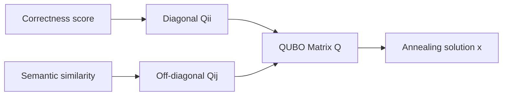

### 7.3 Simulated annealing acceptance rule

Think of it like shaking a box of marbles while slowly reducing the shaking:

- At high temperature: the solver explores wildly (accepts bad moves sometimes)
- At low temperature: the solver settles (only accepts good moves)

**Decision rule for each step:**

- Always accept if the new state has lower energy (`ΔE < 0`)
- Otherwise accept randomly with probability `P = exp(-ΔE / T)`

**Cooling schedule:**

`T_{k+1} = max(T_final, T_k × cooling_rate)`

| Parameter | Value | Effect |
|-----------|-------|--------|
| Initial temp | 100.0 | Starts very exploratory |
| Final temp | 0.01 | Ends very settled |
| Cooling rate | 0.99 | Cools slowly (500 steps) |
| Reads | 2 | Two independent runs, take the best |

### 7.4 Method comparison axis

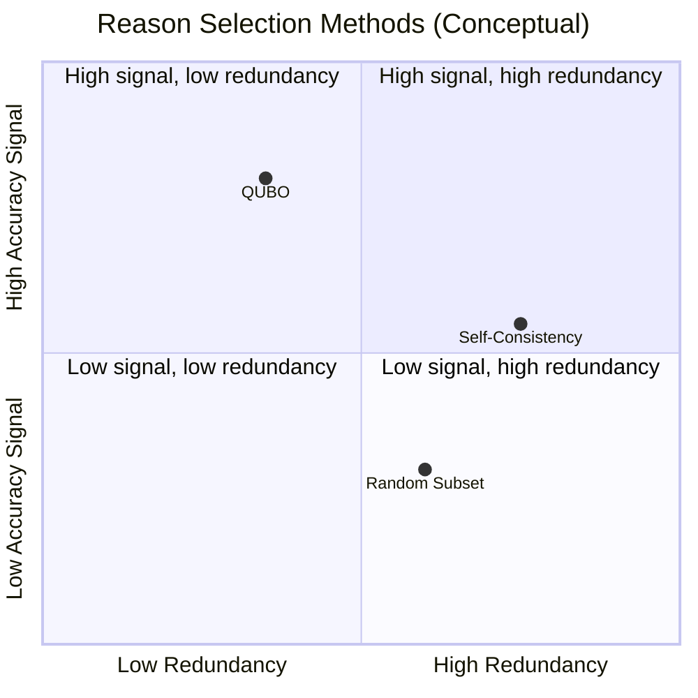

---

## 8) Folder Structure

```text
.
├── config/
│   └── config.yaml
├── evaluation/
│   ├── __init__.py
│   ├── answer_utils.py
│   └── run_gsm8k_comparison.py
├── pipeline/
│   ├── __init__.py
│   ├── sampling.py
│   ├── verifier.py
│   ├── qubo_builder.py
│   ├── solver.py
│   ├── inference.py
│   └── hyperparam_qubo.py
├── scripts/
│   ├── generate_comparison.py        # 7 selection methods comparison
│   ├── evaluate_accuracy.py          # Sanity check on 6 questions
│   └── run_all_benchmarks.py         # Run all 5 benchmarks → CSV/JSON/MD
├── training/
│   └── sft.py                        # SFT stub (needs A100 GPU)
├── outputs/                          # Benchmark results
├── cache/models/                     # Cached model weights
├── requirements.txt
├── IMPLEMENTATION_ROADMAP.md
└── README.md
```

---

## 9) Installation and Setup

### Prerequisites
- Python 3.10+
- Optional GPU for faster model inference
- `pip` or equivalent environment manager

### Quick start

```bash
git clone <your-repo-url>
cd Quantum-Annealing-SLM
python3 -m venv .venv
source .venv/bin/activate
pip install -r requirements.txt
```

### Configuration
Edit `config/config.yaml` for model, sampling, solver, and evaluation parameters.

---

## 10) Usage

### Run all 5 benchmarks (recommended)

```bash
python3 scripts/run_all_benchmarks.py --subset-size 100
```

Runs GSM8K, BBH, StrategyQA, ARC-Challenge, and MMLU in sequence. Each question is evaluated with greedy, CoT, and QUBO pipeline. Outputs CSV + JSON + Markdown.

### Run just GSM8K comparison

```bash
python3 evaluation/run_gsm8k_comparison.py --subset-size 100
```

### Run method comparison (7 selection methods)

```bash
python3 scripts/generate_comparison.py
```

### Run accuracy sanity check

```bash
python3 scripts/evaluate_accuracy.py
```

### Programmatic benchmark runner

```python
from evaluation import BenchmarkRunner

runner = BenchmarkRunner()
results = runner.run_all(pipeline_fn=lambda q: "A")
print(results)
```

---

## 11) Reproducibility Notes

- Keep model checkpoints and tokenizer versions fixed.
- Record `config/config.yaml` snapshot for each run.
- Save outputs (`csv`, `json`, `md`) with timestamps.
- Compare runs at consistent subset sizes before interpreting trends.

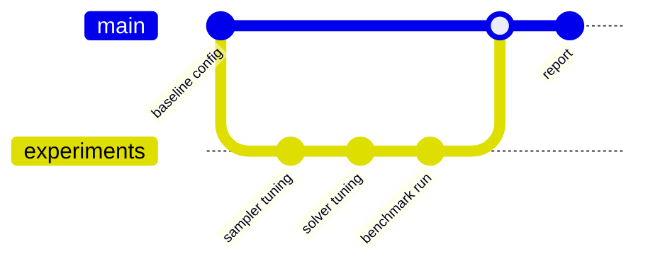

---

## 12) Performance and Evaluation Design

### Current benchmark targets

| Benchmark | Task Type | Status |
|---|---|---|
| GSM8K | math reasoning | Implemented |
| BBH | broad reasoning | Implemented |
| StrategyQA | commonsense QA | Implemented |
| ARC-Challenge | science MCQ | Implemented |
| MMLU (STEM subset) | MCQ reasoning | Implemented |

### Evaluation output artifacts
- Per-sample predictions CSV
- Aggregate summary JSON
- Human-readable report Markdown

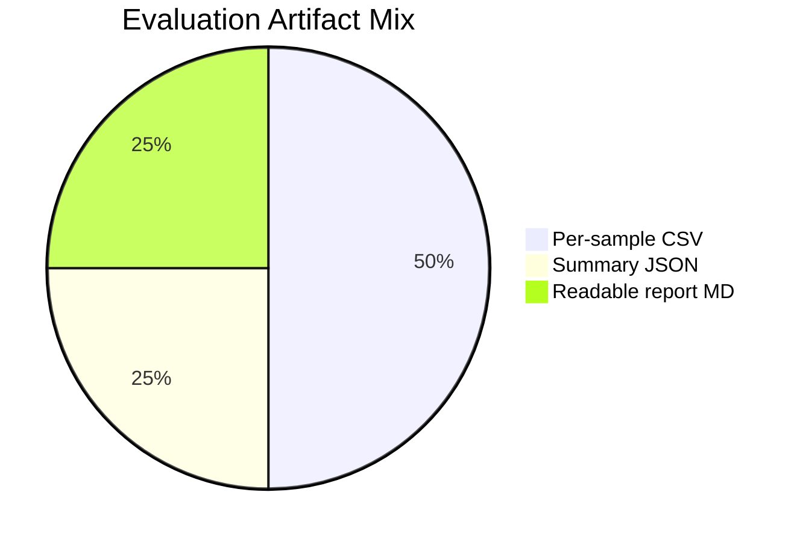

---

## 13) Roadmap


---

## 14) Risk and Tradeoff Analysis

| Area | Benefit | Risk | Mitigation |
|---|---|---|---|
| Diverse sampling | Better search coverage | Higher latency | tune sample count |
| Verifier scoring | Better trace quality signal | Score noise | combine math + NLI signals |
| QUBO selection | principled optimization | quadratic pairwise costs | cap variables via clustering |
| SA optimization | fast approximate solution | local minima | multi-read runs, schedule tuning |

---

## 15) Contributor Guide

### Recommended extension points
- New verifier signals (symbolic math checks, tool calls).
- Alternative QUBO/HUBO formulations.
- Better solver backends (tabu, hybrid, annealer APIs).
- Dataset adapters + benchmark-specific answer normalization.

### Contribution workflow
1. Create feature branch.
2. Keep config diffs explicit.
3. Add experiment script and reproducibility notes.
4. Include output artifact samples where applicable.

---

## 16) Project Maturity Snapshot

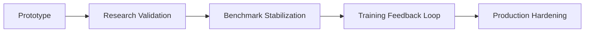

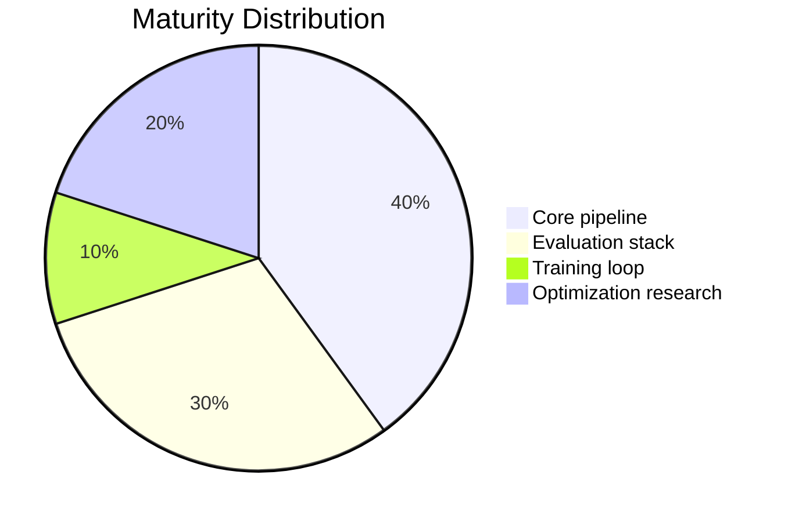

---

## 17) Acknowledgements

- Hugging Face ecosystem (`transformers`, `datasets`)
- Sentence-Transformers for semantic embeddings
- Open-source optimization and scientific Python stack

---

## 18) Citation

If you use this project in reports or demos, cite as:

```bibtex
@misc{quantum_annealing_slm_2026,
  title        = {Quantum-Inspired Annealing for Multi-Stage Reasoning},
  author       = {Project Contributors},
  year         = {2026},
  note         = {Research engineering project repository}
}
```


