# Quantum-Inspired Annealing for Multi-Stage Reasoning

> A modular reasoning framework that generates diverse chains-of-thought, scores them, encodes selection as a QUBO optimization problem, and composes final answers using selected high-value reasoning traces.


---

## 1) Executive Summary

This project implements a **quantum-inspired inference-time reasoning system** for small language models (SLMs). Instead of trusting a single generated chain of thought, the pipeline:

1. samples many diverse candidate reasoning paths,
2. verifies and scores candidate quality,
3. builds a QUBO objective balancing correctness and diversity,
4. solves the optimization via simulated annealing,
5. synthesizes a final answer from selected traces.

### Why this matters
- Standard decoding is brittle for multi-step reasoning.
- Majority-vote style methods improve robustness but can remain redundant.
- Optimization-aware trace selection introduces a principled way to trade off **quality vs diversity**.

### Core novelty
- Treats reasoning-trace selection as an explicit combinatorial optimization problem.
- Integrates lightweight verifier scores and semantic similarity penalties into a unified QUBO matrix.
- Supports benchmark-oriented evaluation workflows (GSM8K, BBH, StrategyQA, ARC-Challenge, MMLU).

---

## 2) Motivation and Background

Modern SLM reasoning often fails due to local decoding errors, shallow heuristics, or brittle intermediate steps. Inference-time ensembling helps, but naively aggregating many traces can over-index on similar errors. This project is motivated by a simple observation:

> The best final answer often emerges from a **small, diverse, high-quality subset** of reasoning traces.

This repository explores a practical mechanism for subset selection using QUBO-style objectives, then uses selected traces to guide final generation.

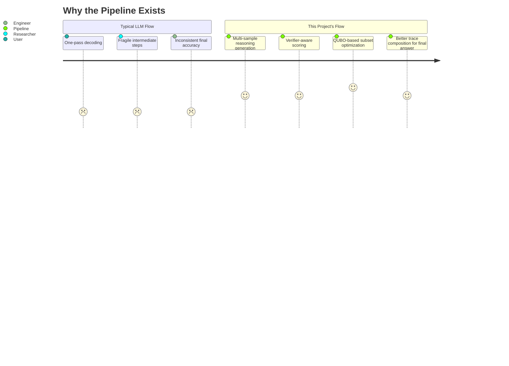

---

## 3) Feature Set

### Functional features
- Multi-template, multi-temperature reasoning sample generation.
- Heuristic + NLI-based reasoning verification.
- Semantic embedding and clustering for trace compression.
- QUBO matrix construction with correctness/diversity terms.
- Simulated annealing solver with configurable schedule.
- Final-answer generation from selected traces.
- Benchmark runners for GSM8K comparisons and multi-benchmark evaluation.

### Technical features
- YAML-driven configuration (`config/config.yaml`).
- GPU auto-detection for model modules (`cuda` when available).
- Modular code design by subsystem (`pipeline`, `evaluation`, `scripts`, `training`).
- Export paths for CSV/JSON/Markdown benchmark reports.

### Capability comparison

| Capability | Baseline Greedy | Plain CoT | This Pipeline |
|---|---:|---:|---:|
| Multiple reasoning traces | No | Limited | Yes |
| Verification step | No | No | Yes |
| Diversity-aware selection | No | No | Yes (QUBO) |
| Optimization objective | No | No | Explicit |
| Benchmark reporting | Basic | Basic | Structured CSV/JSON/MD |

---

## 4) System Architecture

### 4.1 High-level architecture


### 4.2 Module interaction graph

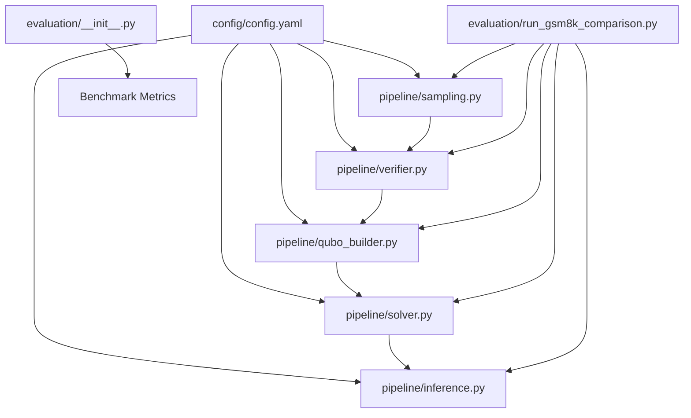

### 4.3 Runtime sequence

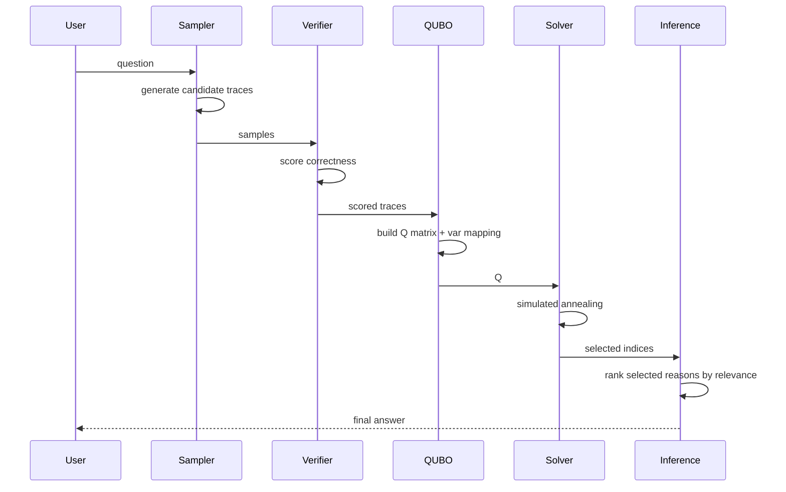

### 4.4 Data-flow model

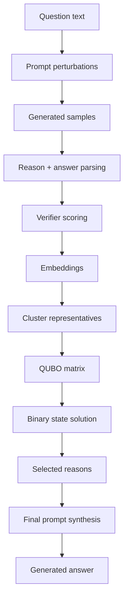

### 4.5 Dependency graph

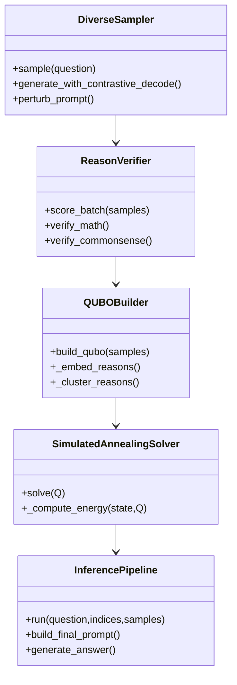

---

## 5) End-to-End Workflow

### Step-by-step processing
1. **Input question** enters sampling stage.
2. **Prompt perturbations** create diverse generation contexts.
3. **Candidate reasons/answers** are parsed from model output.
4. **Verifier scoring** estimates correctness confidence.
5. **Embedding + clustering** reduce redundancy and control variable count.
6. **QUBO matrix** encodes quality/diversity tradeoff.
7. **Annealing solver** finds low-energy binary selection state.
8. **Reason ranking** by semantic relevance to question.
9. **Final prompt composition** from selected traces.
10. **Final answer generation** returned.

### Decision logic

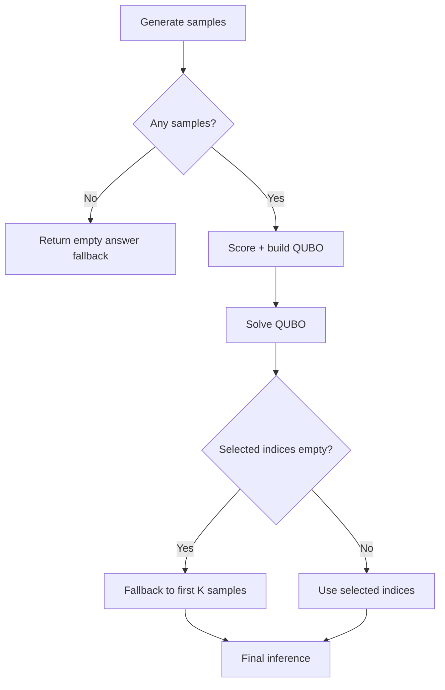

### Pipeline state transitions

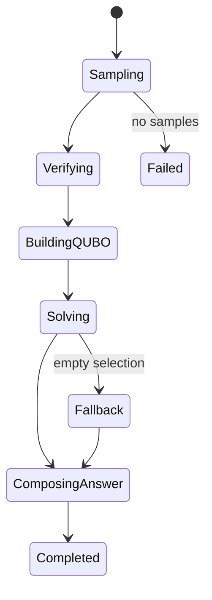

---

## 6) Technical Deep Dive

### `pipeline/sampling.py` - DiverseSampler
- **Purpose:** Generate varied reasoning candidates.
- **Design choices:** multiple prompt templates + random temperatures.
- **Output schema:** `{reason, answer, diversity_score, temperature, prompt_template}`.
- **Tradeoff:** diversity improves coverage but increases inference cost.

### `pipeline/verifier.py` - ReasonVerifier
- **Purpose:** Assign quality estimates to generated traces.
- **Math mode:** extracts arithmetic expressions and checks consistency.
- **Commonsense mode:** NLI entailment score via cross-encoder.
- **Tradeoff:** lightweight heuristics are fast, but not equivalent to symbolic proof checking.

### `pipeline/qubo_builder.py` - QUBOBuilder
- **Purpose:** Convert scored traces into optimization objective.
- **Diagonal terms:** favor high correctness (negative energy reward).
- **Off-diagonal terms:** penalize semantic similarity to encourage diversity.
- **Complexity:** similarity matrix is quadratic in selected variable count.

### `pipeline/solver.py` - SimulatedAnnealingSolver
- **Purpose:** Approximate low-energy binary assignment.
- **Method:** iterative bit flips with Metropolis acceptance.
- **Configuration:** initial/final temperature, cooling rate, iterations, num reads.
- **Tradeoff:** no global optimality guarantee; practical and hardware-light.

### `pipeline/inference.py` - InferencePipeline
- **Purpose:** turn selected reasons into final answer.
- **Logic:** rank selected reasons by embedding relevance, build final prompt, decode deterministically.
- **Tradeoff:** prompt length vs context quality.

### `evaluation/__init__.py` - BenchmarkRunner
- **Purpose:** unified benchmark loading and scoring.
- **Benchmarks:** GSM8K, BBH, StrategyQA, ARC-Challenge, MMLU.
- **Scoring modes:** relaxed text-match for open responses; strict MCQ extraction for A/B/C/D tasks.

---

## 7) Algorithms and Methodology

### 7.1 Objective formulation
Given binary selection vector `x in {0,1}^n` and QUBO matrix `Q`, optimize:

`min E(x) = x^T Q x`

Where:
- `Q_ii` captures quality reward (higher correctness -> lower diagonal energy).
- `Q_ij` captures pairwise redundancy penalty via cosine similarity.

### 7.2 Practical decomposition

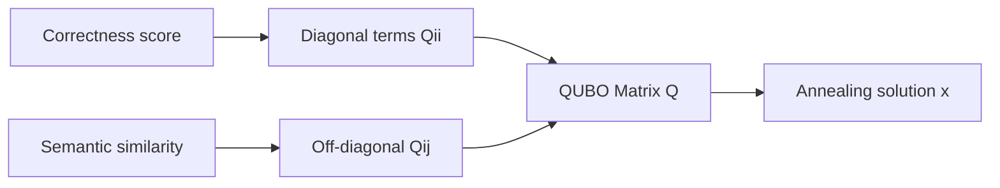

### 7.3 Simulated annealing acceptance rule
For candidate state transition with energy change `DeltaE` and temperature `T`:

- always accept if `DeltaE < 0`
- otherwise accept with probability `exp(-DeltaE / T)`

Cooling schedule (current implementation):

`T_{k+1} = max(T_final, T_k * cooling_rate)`

### 7.4 Method comparison axis

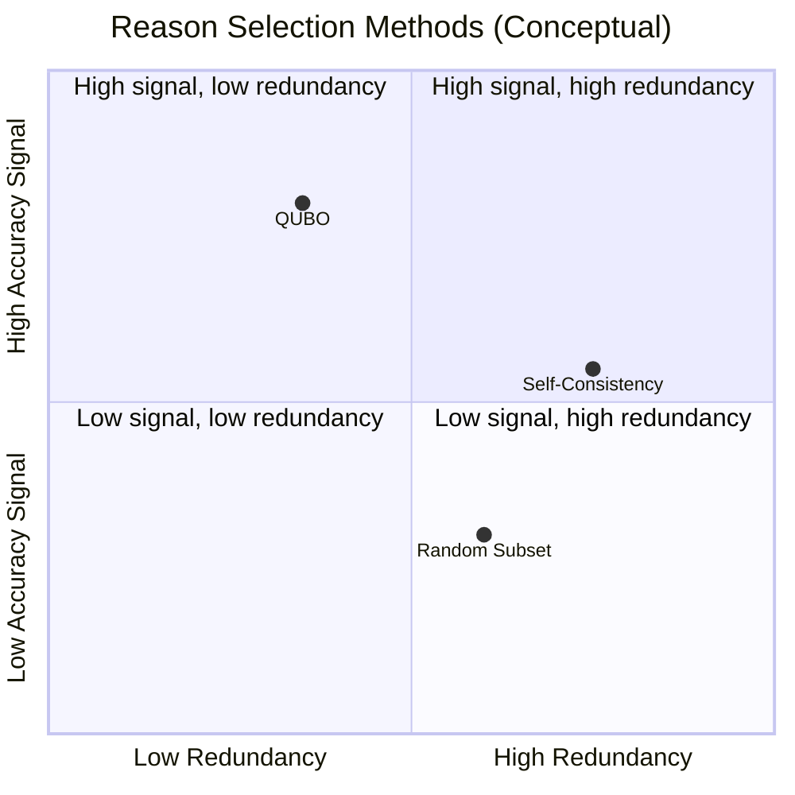

---

## 8) Folder Structure

```text
.
├── config/
│   └── config.yaml
├── evaluation/
│   ├── __init__.py
│   ├── answer_utils.py
│   └── run_gsm8k_comparison.py
├── pipeline/
│   ├── __init__.py
│   ├── sampling.py
│   ├── verifier.py
│   ├── qubo_builder.py
│   ├── solver.py
│   ├── inference.py
│   └── hyperparam_qubo.py
├── scripts/
│   ├── generate_comparison.py
│   └── evaluate_accuracy.py
├── training/
│   ├── __init__.py
│   └── sft.py
├── outputs/
├── cache/
├── requirements.txt
├── IMPLEMENTATION_ROADMAP.md
└── README.md
```

---

## 9) Installation and Setup

### Prerequisites
- Python 3.10+
- Optional GPU for faster model inference
- `pip` or equivalent environment manager

### Quick start

```bash
git clone <your-repo-url>
cd Quantum-Annealing-SLM
python3 -m venv .venv
source .venv/bin/activate
pip install -r requirements.txt
```

### Configuration
Edit `config/config.yaml` for model, sampling, solver, and evaluation parameters.

---

## 10) Usage

### Run GSM8K baseline vs QUBO comparison

```bash
python3 evaluation/run_gsm8k_comparison.py --subset-size 100 --output-dir outputs
```

### Run method comparison utility

```bash
python3 scripts/generate_comparison.py
```

### Run small local accuracy harness

```bash
python3 scripts/evaluate_accuracy.py
```

### Programmatic benchmark runner

```python
from evaluation import BenchmarkRunner

runner = BenchmarkRunner(config_path="config/config.yaml")
results = runner.run_all(pipeline_fn=lambda q: "A")
print(results)
```

---

## 11) Reproducibility Notes

- Keep model checkpoints and tokenizer versions fixed.
- Record `config/config.yaml` snapshot for each run.
- Save outputs (`csv`, `json`, `md`) with timestamps.
- Compare runs at consistent subset sizes before interpreting trends.

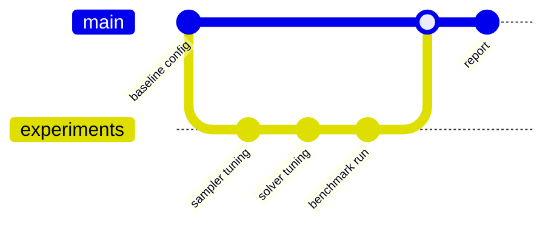

---

## 12) Performance and Evaluation Design

### Current benchmark targets

| Benchmark | Task Type | Status |
|---|---|---|
| GSM8K | math reasoning | Implemented |
| BBH | broad reasoning | Implemented |
| StrategyQA | commonsense QA | Implemented |
| ARC-Challenge | science MCQ | Implemented |
| MMLU (STEM subset) | MCQ reasoning | Implemented |

### Evaluation output artifacts
- Per-sample predictions CSV
- Aggregate summary JSON
- Human-readable report Markdown

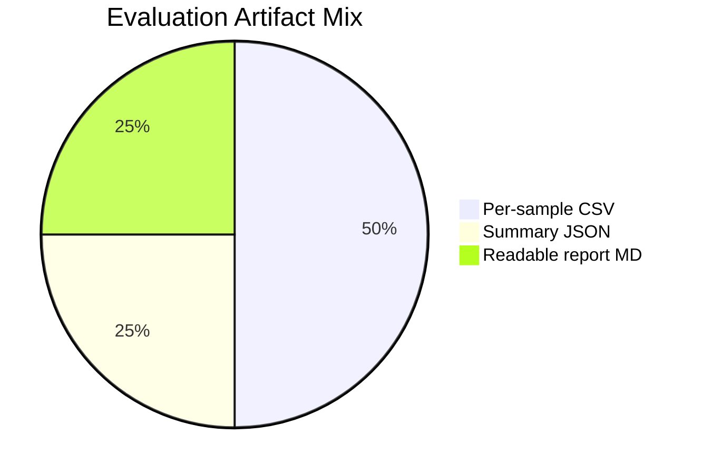

---

## 13) Roadmap

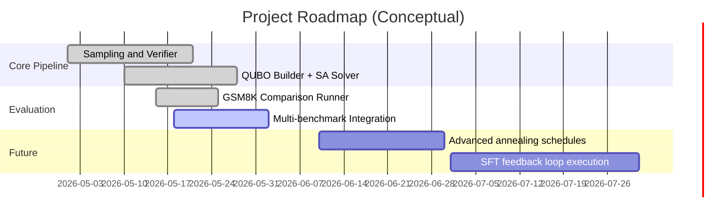

---

## 14) Risk and Tradeoff Analysis

| Area | Benefit | Risk | Mitigation |
|---|---|---|---|
| Diverse sampling | Better search coverage | Higher latency | tune sample count |
| Verifier scoring | Better trace quality signal | Score noise | combine math + NLI signals |
| QUBO selection | principled optimization | quadratic pairwise costs | cap variables via clustering |
| SA optimization | fast approximate solution | local minima | multi-read runs, schedule tuning |

---

## 15) Contributor Guide

### Recommended extension points
- New verifier signals (symbolic math checks, tool calls).
- Alternative QUBO/HUBO formulations.
- Better solver backends (tabu, hybrid, annealer APIs).
- Dataset adapters + benchmark-specific answer normalization.

### Contribution workflow
1. Create feature branch.
2. Keep config diffs explicit.
3. Add experiment script and reproducibility notes.
4. Include output artifact samples where applicable.

---

## 16) Project Maturity Snapshot


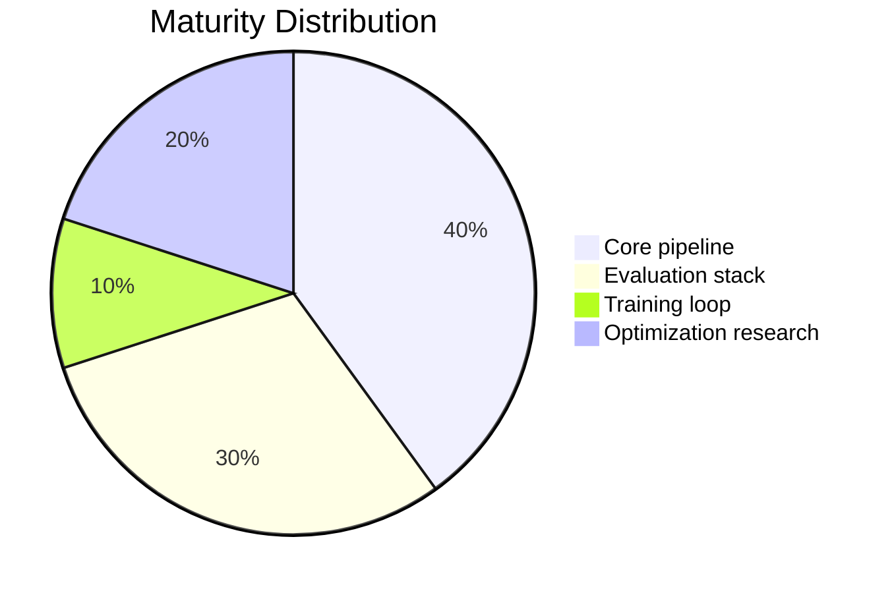

---

## 17) Acknowledgements

- Hugging Face ecosystem (`transformers`, `datasets`)
- Sentence-Transformers for semantic embeddings
- Open-source optimization and scientific Python stack

---

## 18) Citation

If you use this project in reports or demos, cite as:

```bibtex
@misc{quantum_annealing_slm_2026,
  title        = {Quantum-Inspired Annealing for Multi-Stage Reasoning},
  author       = {Project Contributors},
  year         = {2026},
  note         = {Research engineering project repository}
}
```

---

## 19) License

This repository currently uses project-specific internal governance. Add a `LICENSE` file (for example MIT/Apache-2.0) before public open-source release.
