# Quantum-Inspired Annealing for Multi-Stage Reasoning

> A modular reasoning framework that generates diverse chains-of-thought, scores them, encodes selection as a QUBO optimization problem, and composes final answers using selected high-value reasoning traces.


---

## 1) Executive Summary

This project implements a **quantum-inspired inference-time reasoning system** for small language models (SLMs). Instead of trusting a single generated chain of thought, the pipeline:

1. Samples many diverse candidate reasoning paths
2. Verifies and scores candidate quality
3. Builds a QUBO objective balancing correctness and diversity
4. Solves the optimization via simulated annealing
5. Synthesizes a final answer from selected traces

### Why this matters
- Standard decoding is brittle for multi-step reasoning
- Majority-vote methods improve robustness but remain redundant
- Optimization-aware trace selection introduces principled **quality vs diversity** tradeoff

### Core novelty
- Treats reasoning-trace selection as explicit combinatorial optimization
- Integrates lightweight verifier scores and semantic similarity penalties into a unified QUBO matrix
- Supports benchmark-oriented evaluation (GSM8K, BBH, StrategyQA, ARC-Challenge, MMLU)

---

## 2) Motivation and Background

Modern SLM reasoning often fails due to local decoding errors or brittle intermediate steps. Inference-time ensembling helps, but naively aggregating traces over-indexes on similar errors.

> The best final answer often emerges from a **small, diverse, high-quality subset** of reasoning traces.

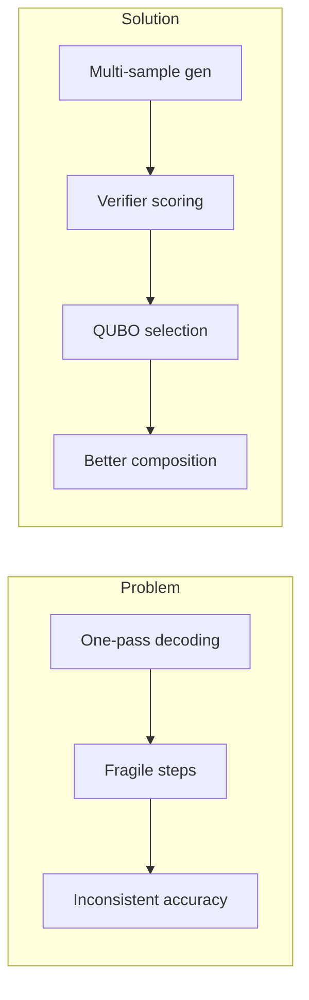

---

## 3) Feature Set

### Functional features
- Multi-template, multi-temperature reasoning generation
- Heuristic + NLI-based verification
- Semantic embedding and clustering for trace compression
- QUBO matrix construction with correctness/diversity terms
- Simulated annealing solver with configurable schedule
- Final answer generation from selected traces
- Benchmark runners for GSM8K and multi-benchmark evaluation

### Technical features
- YAML-driven configuration
- GPU auto-detection
- Modular design by subsystem
- CSV/JSON/Markdown benchmark export

### Capability comparison

| Capability | Baseline Greedy | Plain CoT | This Pipeline |
|---|---:|---:|---:|
| Multiple reasoning traces | No | Limited | Yes |
| Verification step | No | No | Yes |
| Diversity-aware selection | No | No | Yes (QUBO) |
| Optimization objective | No | No | Explicit |
| Benchmark reporting | Basic | Basic | CSV/JSON/MD |

---

## 4) System Architecture

### 4.1 High-level architecture


### 4.2 Module interaction graph

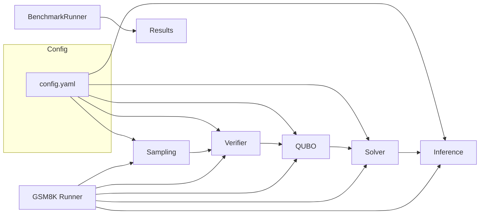

### 4.3 Runtime sequence

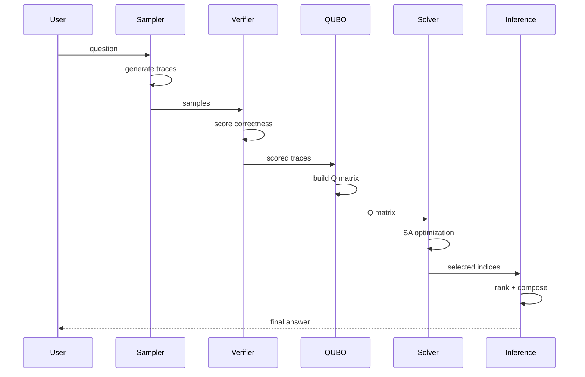

### 4.4 Data-flow model


### 4.5 Dependency graph

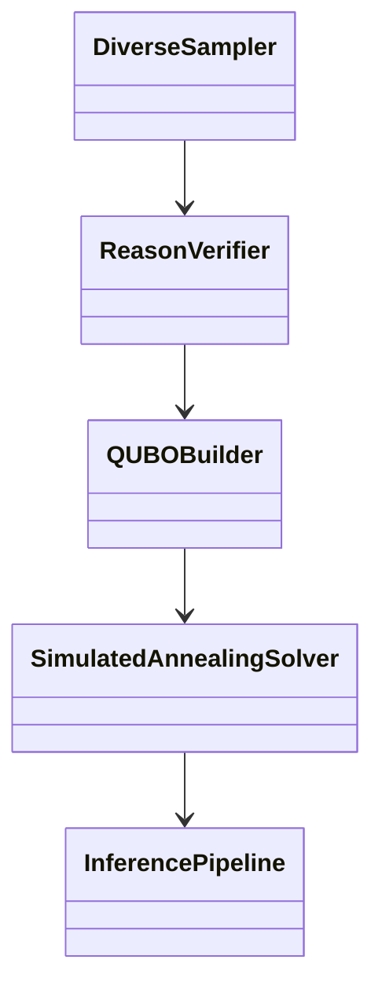

---

## 5) End-to-End Workflow

### Step-by-step processing
1. **Input question** enters sampling stage
2. **Prompt perturbations** create diverse generation contexts
3. **Candidate reasons/answers** are parsed from model output
4. **Verifier scoring** estimates correctness confidence
5. **Embedding + clustering** reduce redundancy and control variable count
6. **QUBO matrix** encodes quality/diversity tradeoff
7. **Annealing solver** finds low-energy binary selection state
8. **Reason ranking** by semantic relevance to question
9. **Final prompt** composed from selected traces
10. **Final answer** returned

### Decision logic

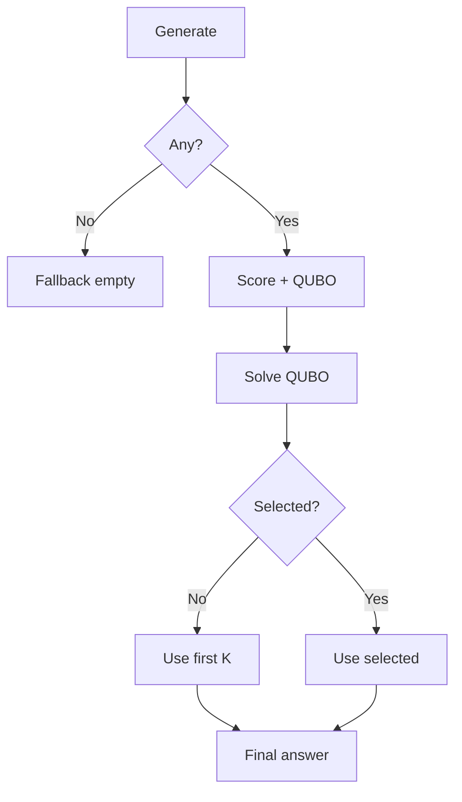

### Pipeline state transitions

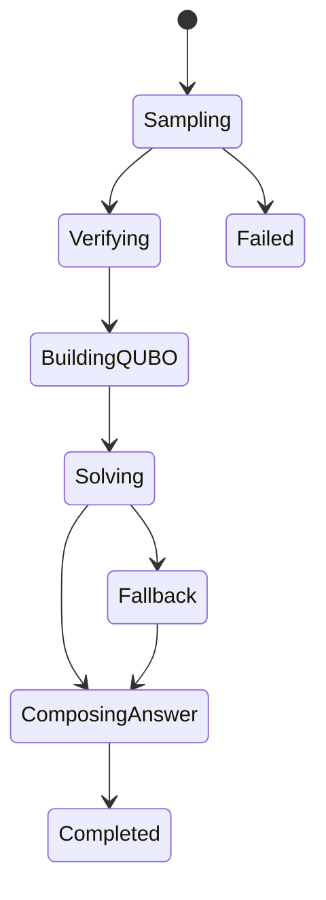

---

## 6) Technical Deep Dive

### `pipeline/sampling.py` - DiverseSampler
- **Purpose:** Generate varied reasoning candidates
- **Design:** 4 prompt templates × random temperatures (0.3–0.9)
- **Output:** `{reason, answer, diversity_score, temp, prompt_template}`

### `pipeline/verifier.py` - ReasonVerifier
- **Purpose:** Assign quality estimates to generated traces
- **Math mode:** Extract arithmetic, check consistency
- **Commonsense mode:** NLI entailment via cross-encoder

### `pipeline/qubo_builder.py` - QUBOBuilder
- **Purpose:** Convert scored traces into optimization objective
- **Diagonal:** favor high correctness `Q[i][i] = -score + diversity_bonus`
- **Off-diagonal:** penalize similarity `Q[i][j] = sim(i,j) * penalty`

### `pipeline/solver.py` - SimulatedAnnealingSolver
- **Method:** Iterative bit flips with Metropolis acceptance
- **Config:** temp 100→0.01, cooling 0.99, 500 iters × 2 reads

### `pipeline/inference.py` - InferencePipeline
- **Logic:** Rank selected reasons by embedding relevance, decode greedily

### `evaluation/__init__.py` - BenchmarkRunner
- **Benchmarks:** GSM8K, BBH, StrategyQA, ARC-Challenge, MMLU
- **Scoring:** Text-match for open responses; MCQ extraction for A/B/C/D

---

## 7) Algorithms and Methodology

### 7.1 Objective formulation
Given binary selection vector `x ∈ {0,1}^n` and QUBO matrix `Q`:

`min E(x) = x^T Q x`

- `Q_ii` captures quality reward
- `Q_ij` captures pairwise redundancy penalty

### 7.2 Practical decomposition

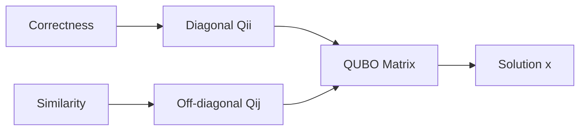

### 7.3 SA acceptance rule
- Always accept if `ΔE < 0`
- Otherwise accept with `P = exp(-ΔE / T)`
- Cooling: `T ← max(T_final, T × cooling_rate)`

### 7.4 Method comparison

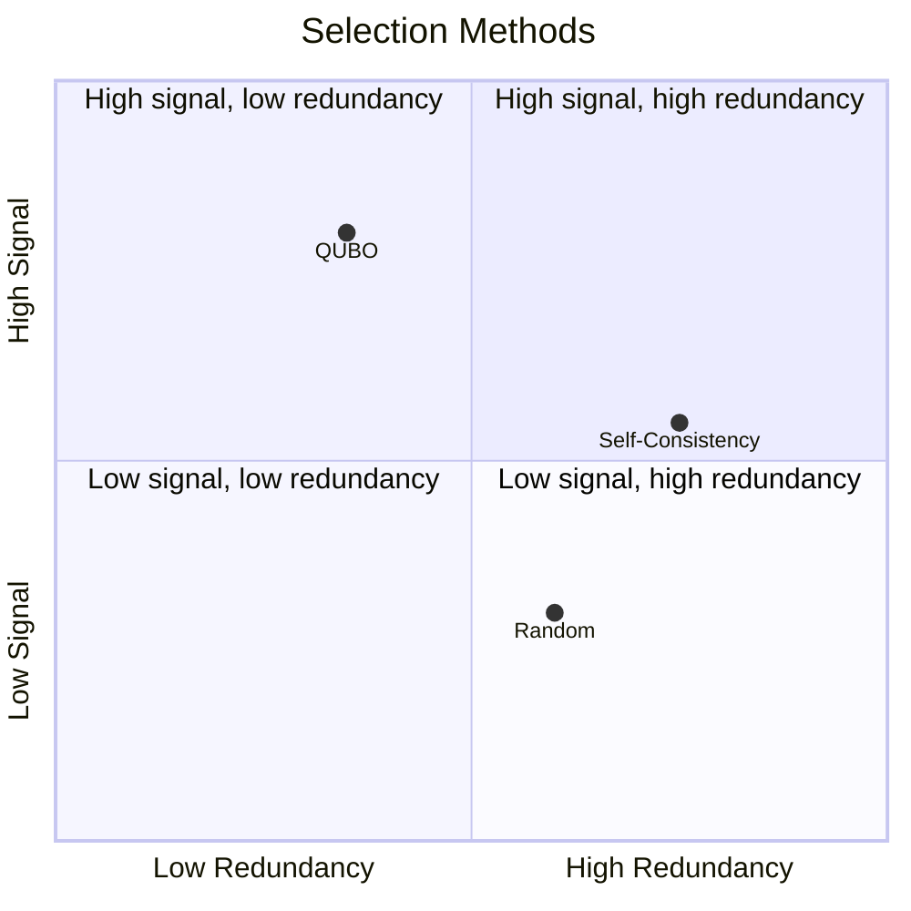

---

## 8) Folder Structure

```text
├── config/config.yaml
├── evaluation/
│   ├── __init__.py          # BenchmarkRunner (all benchmarks)
│   ├── answer_utils.py      # Answer extraction
│   └── run_gsm8k_comparison.py
├── pipeline/
│   ├── __init__.py
│   ├── sampling.py          # DiverseSampler
│   ├── verifier.py          # ReasonVerifier
│   ├── qubo_builder.py      # QUBOBuilder
│   ├── solver.py            # SimulatedAnnealingSolver
│   ├── inference.py         # InferencePipeline
│   └── hyperparam_qubo.py   # HyperparameterQUBO
├── scripts/
│   ├── generate_comparison.py
│   ├── evaluate_accuracy.py
│   └── run_all_benchmarks.py
├── training/sft.py
├── outputs/
├── cache/models/
├── requirements.txt
└── README.md
```

---

## 9) Installation and Setup

### Prerequisites
- Python 3.10+
- Optional GPU
- `pip`

### Quick start

```bash
git clone <repo-url>
cd Quantum-Annealing-SLM
python3 -m venv .venv
source .venv/bin/activate
pip install -r requirements.txt
```

### Configuration
Edit `config/config.yaml` for model, sampling, solver, and evaluation parameters.

---

## 10) Usage

### Run all benchmarks (CSV + JSON + MD)

```bash
python3 scripts/run_all_benchmarks.py --subset-size 100
```

### Run GSM8K comparison

```bash
python3 evaluation/run_gsm8k_comparison.py --subset-size 100
```

### Run method comparison

```bash
python3 scripts/generate_comparison.py
```

### Programmatic benchmark runner

```python
from evaluation import BenchmarkRunner
runner = BenchmarkRunner()
results = runner.run_all(pipeline_fn=lambda q: "A")
```

---

## 11) Reproducibility

- Keep model checkpoints and tokenizer versions fixed
- Record `config.yaml` snapshot per run
- Save outputs with timestamps
- Compare at consistent subset sizes

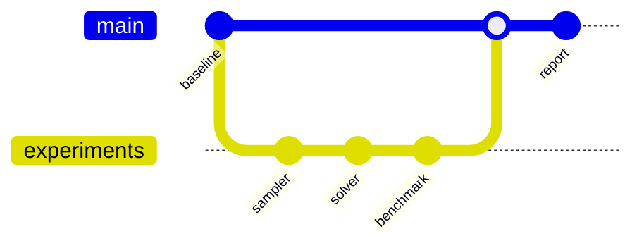

---

## 12) Evaluation

### Benchmark targets

| Benchmark | Task | Status |
|---|---|---|
| GSM8K | Math reasoning | ✅ |
| BBH | Complex reasoning | ✅ |
| StrategyQA | Commonsense QA | ✅ |
| ARC-Challenge | Science MCQ | ✅ |
| MMLU (STEM subset) | MCQ reasoning | ✅ |

### Output artifacts

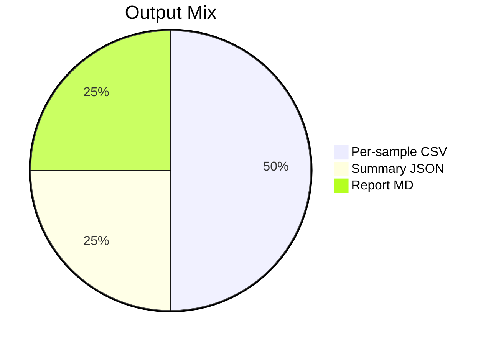

---

## 13) Roadmap

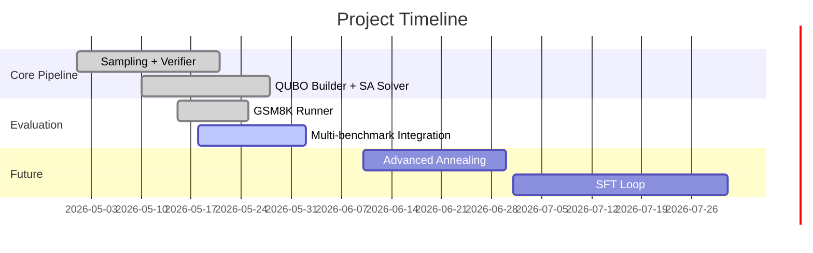

---

## 14) Risk and Tradeoff Analysis

| Area | Benefit | Risk | Mitigation |
|---|---|---|---|
| Diverse sampling | Better coverage | Higher latency | Tune sample count |
| Verifier scoring | Better signal | Score noise | Combine math + NLI |
| QUBO selection | Principled optimization | Quadratic cost | Cap vars via clustering |
| SA optimization | Fast approximation | Local minima | Multi-read, tune schedule |

---

## 15) Contributor Guide

### Extension points
- New verifier signals (symbolic checks, tool calls)
- Alternative QUBO/HUBO formulations
- Better solver backends (tabu, hybrid, annealer APIs)
- Dataset adapters + benchmark-specific normalization

### Workflow
1. Create feature branch
2. Keep config diffs explicit
3. Add experiment script + reproducibility notes
4. Include output artifact samples

---

## 16) Project Maturity

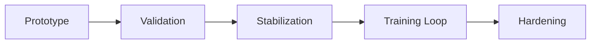

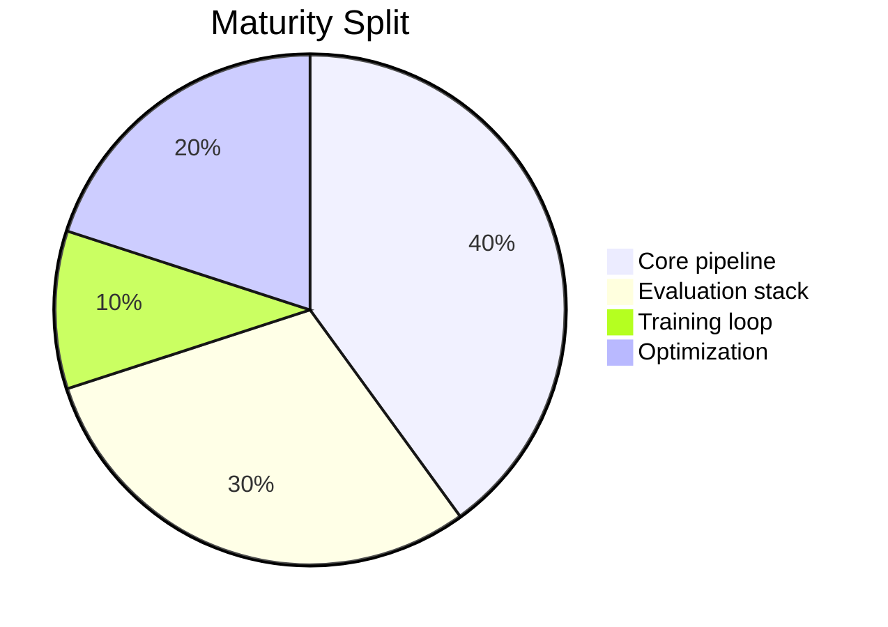

---

## 17) Acknowledgements

- Hugging Face ecosystem (`transformers`, `datasets`)
- Sentence-Transformers for semantic embeddings
- Open-source optimization and scientific Python stack

---

## 18) Citation

```bibtex
@misc{quantum_annealing_slm_2026,
  title  = {Quantum-Inspired Annealing for Multi-Stage Reasoning},
  author = {Project Contributors},
  year   = {2026}
}
```

---

## 19) License

This repository currently uses project-specific internal governance. Add a `LICENSE` file before public open-source release.
